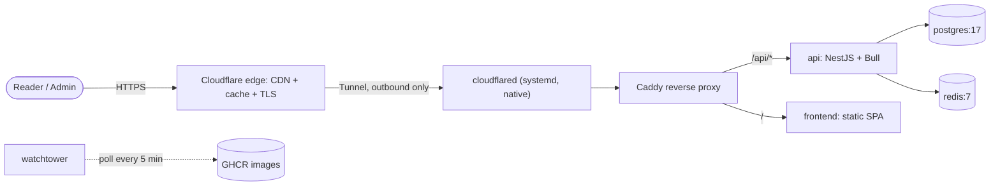

# ADR 0006 — Self-host on a home laptop behind a Cloudflare Tunnel

- **Status:** Accepted — **supersedes** Plan 6 (managed cloud: Vercel + Railway + Neon + Upstash) and **supersedes** Plan 8 (Hetzner VPS, drafted but never executed).
- **Date:** Plan 9 — LIVE 2026-06-07 at `https://smanga.shop`.
- **Sources:** `CLAUDE.md` § "State of play" and § "Architectural decisions (the why)"; design spec `docs/superpowers/specs/2026-06-05-plan-9-laptop-self-host-design.md`; `deploy/home/docker-compose.prod.yml`; `deploy/home/Caddyfile`; `deploy/home/cloudflared/config.yml.example`; `deploy/home/scripts/backup.sh`; `docs/home-runbook.md`.

## Context

SManga is a single-author hobby project targeting ~100–1000 users. Plan 6 ran it on managed cloud (Vercel + Railway + Neon + Upstash) at $5–40/mo. The owner had a spare home laptop (Ubuntu 24.04) and wanted to cut recurring cost to roughly electricity-only, accepting that this is a hobby project without a professional SLA.

A home/residential connection has no static public IP and typically cannot accept inbound ports — so a direct port-forward was undesirable.

## Decision

Run **production on a home laptop** (`sunny-server`, Ubuntu 24.04), exposed publicly via a **Cloudflare Tunnel** (outbound-only connection, no port forwarding or public IP). The topology:

- A **5-container docker compose**: `postgres:17-alpine`, `redis:7-alpine`, `api`, `frontend`, `caddy`, plus `watchtower` (the prod compose adds Caddy as a sixth container; `CLAUDE.md`'s "5-container" count is the app set — postgres, redis, api, frontend, watchtower).
- `cloudflared` runs **natively** under systemd (not in docker).
- **CI/CD is zero-touch**: push to `main` → GitHub Actions builds `ghcr.io/sun-0207/smanga-{api,frontend}:latest` → Watchtower polls GHCR every 5 min and pulls + restarts. Migrations run on every api boot via the docker-compose `command` override (`sh -c "pnpm --filter @smanga/db migrate && node apps/api/dist/main.js"` in `deploy/home/docker-compose.prod.yml`, not the Dockerfile CMD; idempotent through the Drizzle journal table).
- **Backups** are dual-tier: a nightly `pg_dump` at 02:30 to `/mnt/hdd/backups/` (30-day retention) plus an offsite copy (Google Drive `gdrive:smanga-backups`, 14-day retention).

## Consequences

**Easier**

- Cost drops from $5–40/mo to ~$3/mo (electricity).
- Full control of the stack; no managed-service lock-in.
- The tunnel removes the need for a public IP / port-forwarding; Cloudflare provides TLS and edge caching for free.

**Harder / trade-offs**

- **Single point of failure**: residential ISP downtime, WiFi-only, no UPS (laptop battery is the informal UPS) — accepted for a hobby project.
- **No staging / single environment**: Plan 9 originally reserved Vercel as staging, but it was **retired the same day (2026-06-07)**. There are no PR previews, no pre-merge URL, and no rollback-to-staging path; a bad push to `main` can take `smanga.shop` offline once Watchtower pulls it. (Stale "Vercel staging" references in the Plan 9 spec carry an amendment banner.)
- Watchtower must use an actively-maintained fork (`nickfedor/watchtower`) because the upstream stalled at a Docker-API-incompatible version.

## Alternatives considered

- **Managed cloud (Plan 6: Vercel + Railway + Neon + Upstash)** — retired; recurring cost and more moving parts than a hobby project warranted.
- **VPS (Plan 8: Hetzner CX23 + Cloudflare proxy + R2 backup, ~$5/mo)** — drafted but never executed; the spare laptop made even the flat VPS fee avoidable.

## Related

- Deployment view: [`../architecture/07-deployment-view.md`](../architecture/07-deployment-view.md)
- Operator runbook: [`../home-runbook.md`](../home-runbook.md)
