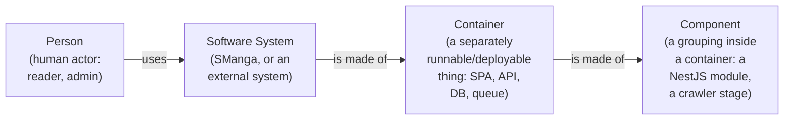

# Architecture documentation (arc42)

This is the architecture documentation for **SManga**, a Vietnamese novel reader. It
follows the [arc42](https://arc42.org/) template: a fixed set of numbered sections, each
answering one architectural question. Every section is **derived from the real code** and
cites the source files it summarises, so it stays trustworthy as the system evolves.

> A thin section is fine. Where a topic does not apply to a single-author hobby project
> (e.g. heavyweight stakeholder analysis), the section stays short on purpose.

## How to read this set

Read top-to-bottom for a full picture, or jump straight to the section that answers your
question:

| # | Section | Answers |
|---|---------|---------|
| [01](01-introduction-and-goals.md) | Introduction and goals | What is SManga for, and what quality goals drive the design? |
| [02](02-constraints.md) | Constraints | What hard limits (hobby budget, Windows dev, single environment) shape every decision? |
| [03](03-context-and-scope.md) | Context and scope | What are the system boundaries and external actors? (C4 Level 1 — System Context) |
| [04](04-solution-strategy.md) | Solution strategy | Which fundamental tech choices were made, and why? (links to ADRs) |
| [05](05-building-blocks.md) | Building blocks | How is the system decomposed into containers and components? (C4 Levels 2 + 3) |
| [06](06-runtime-view.md) | Runtime view | How do the key flows (crawl, discovery, read, auth, auto-crawl) play out at runtime? |
| [07](07-deployment-view.md) | Deployment view | How is it deployed (laptop self-host, Cloudflare Tunnel, CI → GHCR → Watchtower)? |
| [08](08-crosscutting-concepts.md) | Crosscutting concepts | Auth, queue, caching, gzip content, search, config, logging, errors. |
| [09](09-quality-and-risks.md) | Quality and risks | How are quality goals met, and what are the known risks / tech debt? |
| [10](10-glossary.md) | Glossary | Domain (truyện, chương, stub, watermark…) and technical terms. |

Related material that lives outside arc42:

- **Decisions** — [`docs/adr/`](../adr/README.md): one record per fundamental choice (MADR format). §04 links each strategy row to its ADR.
- **Business logic** — [`docs/business-logic/`](../business-logic/domain-model.md): the domain rules in depth (crawling, reading/engagement, admin/moderation).
- **Reference** — [`docs/reference/`](../reference/data-model.md): the exhaustive data model, API surface, configuration, and commands.
- **Onboarding** — [`../../ONBOARDING.md`](../../ONBOARDING.md): the day-1 "get it running" tutorial.

## The C4 legend (used in §03 and §05)

The architecture diagrams use the [C4 model](https://c4model.com/) levels, drawn as
Mermaid `flowchart`s:

Diagram source (Mermaid)

- **Level 1 — System Context** ([§03](03-context-and-scope.md)): SManga as one box, surrounded by the people and external systems it talks to.
- **Level 2 — Container** ([§05](05-building-blocks.md)): the runnable parts inside SManga (frontend SPA, API, Postgres, Redis) and the libraries they share.
- **Level 3 — Component** ([§05](05-building-blocks.md)): the modules inside the API and the stages inside the crawler engine.

Arrows always read **"calls / sends data to"** in the direction of the arrow; each edge is
labelled with the protocol or payload where it matters.

## Status

The architecture described here reflects the **NestJS + Vite** stack introduced by Plan 4
(the original Next.js full-stack design from the 2026-05-28 spec was retired) and the
**laptop self-host** deployment from Plan 9. Where an older spec disagrees with the code,
the code wins — these docs follow the code.
