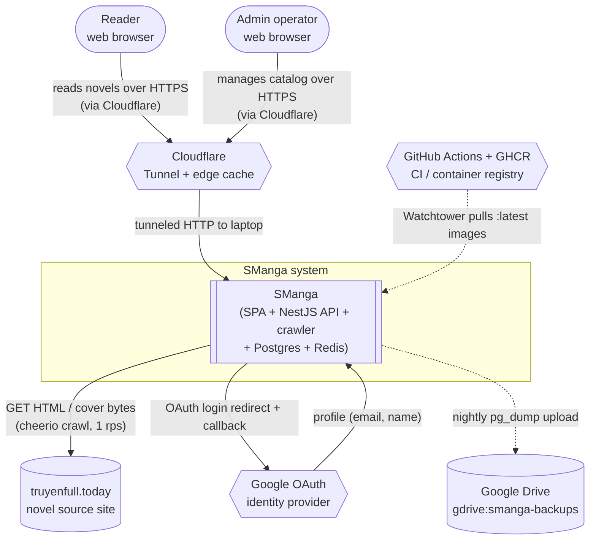

# 03 — Context and Scope

> arc42 §3. This is the **C4 Level 1 (System Context)** view: SManga as one box, the people and external systems it talks to, and what flows across each boundary. A thin compartment is fine here — the detail lives in [§05 Building Blocks](05-building-blocks.md) and [§06 Runtime View](06-runtime-view.md).

## What SManga is (one sentence)

SManga is a Vietnamese web novel reader: it crawls novels from external source sites, stores them in Postgres, and serves a reader-facing SPA plus an admin operator surface. See [§01 Introduction and Goals](01-introduction-and-goals.md).

## System Context (C4 L1)

## External actors and systems

| Party | Type | Interface / what flows | Cited source |
| --- | --- | --- | --- |
| **Reader** | Human (browser) | Browses the catalog, reads chapters, registers/logs in, bookmarks, rates, comments, tracks reading progress. Talks HTTPS to the SPA; the SPA calls the REST API under `/api/v1` (axios client base `/api/v1`, `withCredentials: true`). | `apps/frontend/src/lib/api-client.ts`; reader routes under `apps/frontend/src/routes/` |
| **Admin operator** | Human (browser) | The single owner/operator (`son.cu@opswat.com`). Imports stories, runs discovery, curates featured stories, runs bulk crawl actions, moderates comments, toggles runtime settings. Reaches admin-prefixed endpoints (`/api/v1/admin/*`, `/api/v1/sources`, `/api/v1/jobs`) behind a JWT-cookie + role guard. | `apps/api/src/modules/{users,sources,jobs,app-settings}`; admin routes under `apps/frontend/src/routes/admin/` |
| **`truyenfull.today`** | External system (HTTP) | The crawl source. The crawler issues `GET` requests for catalog/chapter-list/chapter HTML and cover image bytes, rate-limited to **1 rps** per source via a token bucket. Static HTML, so cheerio parses it (no JS rendering — `requiresJs: false`). | `packages/crawler/src/{fetcher,rate-limit,cover}.ts`; `packages/crawler/src/sources/truyenfull/index.ts` |
| **Cloudflare** | External system (network/CDN) | Public entry point. A Cloudflare Tunnel (`cloudflared`) bridges the public `https://smanga.shop` hostname to the laptop with no port forwarding; Cloudflare's edge also caches cacheable responses (covers, sitemaps) per the API's `Cache-Control` / `ETag` headers. | `CLAUDE.md` (Plan 9); cache headers in `apps/api/src/modules/covers/covers.controller.ts` + `seo/seo.controller.ts`. See [§07 Deployment View](07-deployment-view.md). |
| **Google OAuth** | External system (HTTP) | Optional social login. The API exposes a Google OAuth strategy (passport-google) so readers can sign in with a Google account; Google returns the profile, the API mints the same JWT cookie as password login. | `apps/api/src/modules/auth/google.strategy.ts`, `auth.controller.ts` |
| **Google Drive** | External system (backup sink) | Off-site backup target. A nightly `pg_dump` is uploaded to the rclone remote `gdrive:smanga-backups` (14-day retention) in addition to the local HDD copy. Outbound only. | `CLAUDE.md`; `deploy/home/scripts/backup.sh`. See [§07 Deployment View](07-deployment-view.md). |
| **GitHub Actions + GHCR** | External system (CI/CD) | Build/release plane. Pushing `main` triggers GitHub Actions to build and publish `ghcr.io/sun-0207/smanga-{api,frontend}:latest`; the laptop's Watchtower polls GHCR and pulls/restarts containers. | `.github/workflows/{ci,build-images}.yml`; `CLAUDE.md`. See [§07 Deployment View](07-deployment-view.md). |

## Scope (in / out)

**In scope**

- Crawling novel metadata, chapter lists, and chapter content from a source site through a pluggable `SourceAdapter` (`packages/shared/src/adapter.ts`). truyenfull is the only adapter today.
- Persisting the domain in Postgres (stories, chapters, sources, genres, users, engagement, comments, job failures, runtime settings).
- Serving readers a React SPA and a versioned REST API (`/api/v1`) plus non-versioned SEO routes (`/sitemap*.xml`, `/robots.txt`).
- An admin operator surface for catalog management, crawl orchestration (Bull/Redis queue), moderation, and runtime configuration.

**Out of scope**

- Multi-tenant or multi-operator administration — there is one operator account.
- A managed cloud platform, autoscaling, or a formal SLA — SManga self-hosts on a home laptop (single environment, no staging). See [§02 Constraints](02-constraints.md).
- Payments, DRM, or content licensing.
- A native/mobile app — the reader is a responsive web SPA.

## Where to go next

- Container and component decomposition → [§05 Building Blocks](05-building-blocks.md)
- How requests actually move through the system → [§06 Runtime View](06-runtime-view.md)
- Physical/infra topology and the Cloudflare/Watchtower/backup story → [§07 Deployment View](07-deployment-view.md)
