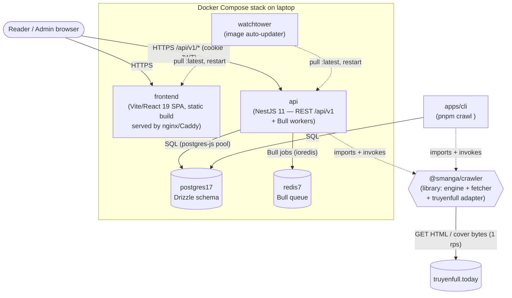
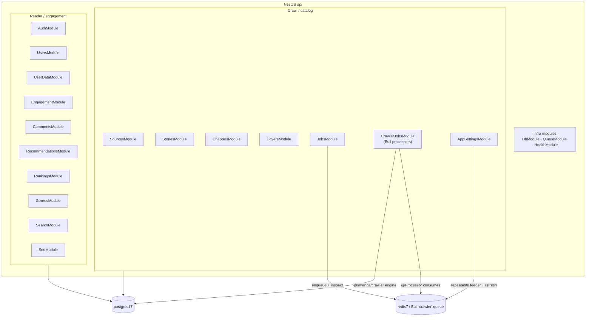
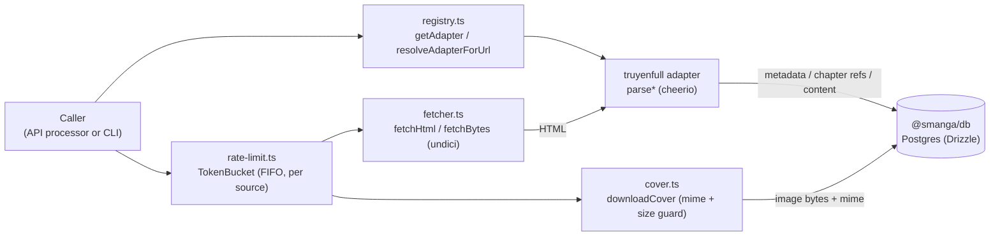

# 05 — Building Block View

> arc42 §5. This is the **C4 Level 2 (Container)** view plus two **Level 3 (Component)** zoom-ins: the NestJS API modules and the crawler engine pipeline. Every name below is taken from the code (paths cited inline). For the external boundary see [§03 Context and Scope](03-context-and-scope.md); for behaviour over time see [§06 Runtime View](06-runtime-view.md).

## Level 2 — Containers

The deployed system is a 5-container Docker Compose stack on the laptop, plus the `cli` and `crawler` which are *libraries/processes* rather than long-running services. The crawler engine is a workspace **package** (`@smanga/crawler`) imported by both the API (for its queue processors) and the standalone CLI.

Diagram source (Mermaid)

**Container responsibilities**

| Container / unit | Tech | Responsibility | Protocol(s) |
| --- | --- | --- | --- |
| `frontend` | Vite + React 19 SPA | Reader pages + admin UI. Calls the API; no server-side logic of its own. | Serves static assets over HTTP; calls REST `/api/v1/*` with `withCredentials` (cookie JWT). Base URL `/api/v1` (`apps/frontend/src/lib/api-client.ts`). |
| `api` | NestJS 11 | REST API (`/api/v1`, versioned), SEO routes, **and** the Bull queue workers (crawler processors run in-process). Bootstraps with helmet, compression, cookie-parser, CORS, global `ValidationPipe`, Swagger at `/api/docs` (`apps/api/src/main.ts`). | HTTP in; Postgres via `postgres-js`; Redis via `ioredis` (`@nestjs/bull`). |
| `postgres17` | Postgres 17 + Drizzle ORM | Single source of truth: stories, chapters (gzipped `content_text` bytea), sources, genres, users/sessions, engagement, comments, job failures, runtime settings. | Pooled SQL (`createDb(url, DB_POOL_MAX)`, `packages/db/src/client.ts`). |
| `redis7` | Redis 7 + Bull | Crawler job queue `crawler` (one named queue, multiple job types). Migrations run on api boot, not here. | RESP over `ioredis`. |
| `watchtower` | Watchtower | Polls GHCR every few minutes, pulls new `:latest` images, restarts `api`/`frontend`. | Docker socket + GHCR pulls. See [§07 Deployment View](07-deployment-view.md). |
| `@smanga/crawler` | TypeScript library (cheerio + undici) | Crawl engine: fetch → rate-limit → adapter parse → cover download → persist. Imported by `api` (queue processors) and `cli`. Registers adapters as an import side effect (`import '@smanga/crawler'` in `app.module.ts`). | In-process function calls; outbound HTTP to the source. |
| `apps/cli` | Node CLI | `pnpm crawl <url>` — standalone single-URL import using the same engine. Kept after the NestJS rework. | In-process; SQL to Postgres. |

Other workspace packages that aren't containers: `@smanga/db` (Drizzle schema + migrations + client) and `@smanga/shared` (Zod schemas, the `SourceAdapter` contract, error classes, job-payload types).

## Level 3a — API modules (component view)

The API root module (`apps/api/src/app.module.ts`) wires the following feature modules. Each is a directory under `apps/api/src/modules/`.

Diagram source (Mermaid)

**Module → responsibility → key files** (controller path prefixes are under the global `/api/v1`; verified from each `@Controller(...)` decorator):

| Module | Responsibility | Key files |
| --- | --- | --- |
| `DbModule` | Provides the Drizzle `Database` via the `DRIZZLE` injection token (`createDb(DATABASE_URL, DB_POOL_MAX)`). | `db/db.module.ts`, `db/db.provider.ts` |
| `QueueModule` | Configures Bull root (`ioredis` connection, default job options: `attempts:2`, exponential backoff, `removeOnComplete`/`removeOnFail` caps) and registers the single `crawler` queue with extended lock/stall settings. | `queue/queue.module.ts`, `queue/queue.constants.ts`, `queue/enqueue.util.ts`, `queue/queue-capacity.ts` |
| `CrawlerJobsModule` | The Bull **processors** that run the crawler engine: `import-story`, `discover-chapters`, `fetch-chapter`, `discover-all-source`. | `crawler-jobs/{import-story,discover-chapters,fetch-chapter,discover-all-source}.processor.ts` |
| `JobsModule` | Job orchestration/inspection API (`jobs`): enqueue crawl actions, queue stats, bulk retry; dead-letter capture via `JobFailureListener`; stuck-job reconciliation via `RetryReconcilerService`. | `jobs/jobs.controller.ts`, `jobs/jobs.service.ts`, `jobs/job-failure.listener.ts`, `jobs/retry-reconciler.service.ts`, `jobs/dead-letter.util.ts` |
| `SourcesModule` | Crawl sources (`sources`): list/create sources, browse + search a source's catalog feeds, trigger discovery. | `sources/sources.controller.ts`, `sources/sources.service.ts` |
| `StoriesModule` | Stories (`stories`): list/detail by slug, featured curation, per-story crawl-state, import + set-auto-refresh DTOs. | `stories/stories.controller.ts`, `stories/stories.service.ts` |
| `ChaptersModule` | Chapters (`chapters`): list a story's chapters and serve a single chapter's content (gunzip on read), crawl DTO. | `chapters/chapters.controller.ts`, `chapters/chapters.service.ts` |
| `CoversModule` | Cover images (`cover/:storyId`): serves bytea cover with `Cache-Control: public, max-age=31536000, immutable` + SHA-1 `ETag` (304 on `If-None-Match`). | `covers/covers.controller.ts` |
| `AppSettingsModule` | Runtime settings (`admin/settings/auto-refresh`, `.../auto-retry`, `.../auto-crawl`) + the scheduled `refresh-all-stories` processor and the `autocrawl-feeder` repeatable feeder. | `app-settings/{app-settings,auto-retry,auto-crawl}.controller.ts`, `app-settings/{refresh-all-stories,auto-crawl-feeder}.processor.ts`, `app-settings/app-settings.service.ts` |
| `AuthModule` | Auth (`auth`): password register/login, Google OAuth strategy, JWT cookie issue, `/auth/me`. | `auth/auth.controller.ts`, `auth/auth.service.ts`, `auth/jwt.strategy.ts`, `auth/google.strategy.ts` |
| `UsersModule` | Admin user management (`admin/users`): list users, change role. | `users/users.controller.ts`, `users/users.service.ts` |
| `UserDataModule` | Per-user data (`me/*`): bookmarks (`me/bookmarks`), reading progress (`me/reading-progress`), reading stats (`me/stats`). | `user-data/{bookmarks,reading-progress,stats}.controller.ts` + services |
| `EngagementModule` | Ratings (`ratings`) and view counting (`views`). | `engagement/ratings.controller.ts`, `engagement/views.controller.ts`, `engagement/engagement.service.ts` |
| `CommentsModule` | Comments (`comments`) — threaded/tree, plus notifications (`me/notifications`) for @mentions/replies. | `comments/comments.controller.ts`, `comments/comments.service.ts`, `comments/notifications.{controller,service}.ts` |
| `RecommendationsModule` | Recommendations: `recommendations` (similar) and `me/recommendations` (personalised "for you"). | `recommendations/recommendations.controller.ts`, `recommendations/recommendations.service.ts` |
| `RankingsModule` | Rankings (`rankings`): hot/most-viewed style leaderboards. | `rankings/rankings.controller.ts`, `rankings/rankings.service.ts` |
| `GenresModule` | Genres (`genres`): list thể loại + stories per genre. | `genres/genres.controller.ts`, `genres/genres.service.ts` |
| `SearchModule` | Vietnamese search (`search`) over the `pg_trgm` + `immutable_unaccent` index. | `search/search.controller.ts`, `search/search.service.ts` |
| `SeoModule` | SEO routes (version-neutral, root path): `/sitemap.xml`, `/sitemap-stories.xml`, sharded `/sitemap-chapters-:n.xml` (+ legacy `/sitemap-chapters.xml`), `/robots.txt`, all with 24h cache + `ETag`. | `seo/seo.controller.ts`, `seo/seo.service.ts` |
| `HealthModule` | Liveness/readiness (`health`). | `health/health.controller.ts` |

> Note: the `crawler` Bull queue is a **single named queue** (`QUEUE_CRAWLER = 'crawler'`); job *types* (`import-story`, `discover-chapters`, `fetch-chapter`, `discover-all-source`, `refresh-all-stories`, `autocrawl-feed`, plus the `retry-reconciler`) are differentiated by name and integer **priority** (lower = higher; `FETCH_CHAPTER:1` … `AUTOCRAWL_FETCH:30`) defined in `queue/queue.constants.ts`. See [§06 Runtime View](06-runtime-view.md) and [§08 Crosscutting Concepts](08-crosscutting-concepts.md).

## Level 3b — Crawler engine (component view)

`@smanga/crawler` (`packages/crawler/src/`) is the pipeline behind every crawl job. The engine never receives a `SourceAdapter` directly: it resolves one from the **registry** (by id or by URL hostname) and calls adapter methods with **HTML strings**, not URLs — the engine owns fetching, rate-limiting, retries, cover download, and persistence.

Diagram source (Mermaid)

**Engine flow (the `fetch-chapter` path, `packages/crawler/src/engine.ts::fetchChapterById`)**

1. **Resolve adapter** — `getAdapter(sourceId)` from `registry.ts`; the truyenfull adapter is registered as an import side effect (`packages/crawler/src/index.ts`).
2. **Rate-limit** — `bucketFor(adapter.id, adapter.rateLimit.rps)` returns a per-source `TokenBucket` (`rate-limit.ts`); `await bucket.acquire()` serialises callers FIFO so concurrent processors can't burst past 1 rps.
3. **Fetch** — `fetchHtml(url)` (`fetcher.ts`, undici `request`) with a browser User-Agent; classifies `429/503` → `RateLimitError`, other `>=400` / network → `FetchError`.
4. **Parse** — `adapter.fetchChapterContent(html)` (cheerio parse in `sources/truyenfull/parsers.ts`; chapter title selector is `a.chapter-title`, next-page detection via `.glyphicon-menu-right`).
5. **Compress + persist** — gzip the UTF-8 text off the event loop, then write `chapter.content_text` (gzipped bytea), `content_byte_size` (the **uncompressed** length), `status='crawled'`, `crawled_at`. On error: `status='failed'`, `last_error=msg`, and rethrow (so Bull records the failure → dead-letter).

Import/discover paths reuse the same fetch→rate-limit→parse→persist shape:

- `importStoryMetadata` — parse story page, dedup by `(sourceId, externalId)` on `story_source`, download cover (metered through the same bucket), insert `story` + `story_source` + genres; sets `discovery_status='pending'`.
- `discoverChapters` — paginate the chapter-list pages, insert `pending` chapter rows (`ON CONFLICT DO NOTHING`), set `discovery_status` running → complete/failed.
- `browseCatalog` / `searchCatalog` — fetch a feed/search page, parse, and annotate each item with `existingStoryId` / `existingDiscoveryStatus` so the admin UI shows "already imported".

## Where to go next

- Behaviour over time (crawl, discovery, read path, auth, auto-crawl drainer) → [§06 Runtime View](06-runtime-view.md)
- The single big technical decisions → [§04 Solution Strategy](04-solution-strategy.md) and the [ADRs](../adr/README.md)
- Cross-cutting mechanics (queue priorities, gzip, caching, search) → [§08 Crosscutting Concepts](08-crosscutting-concepts.md)
