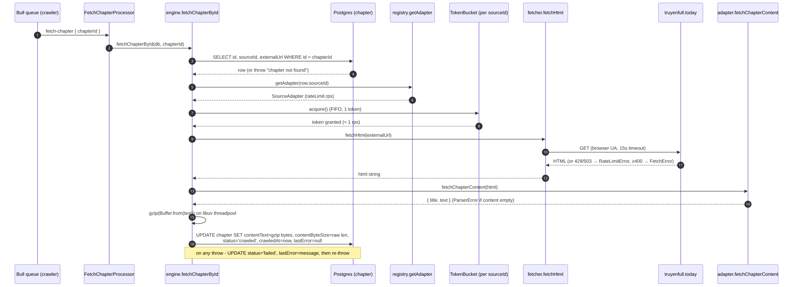
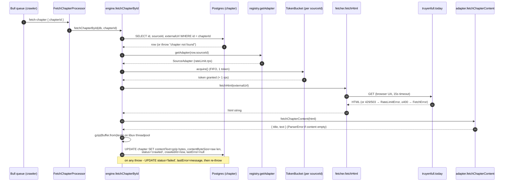
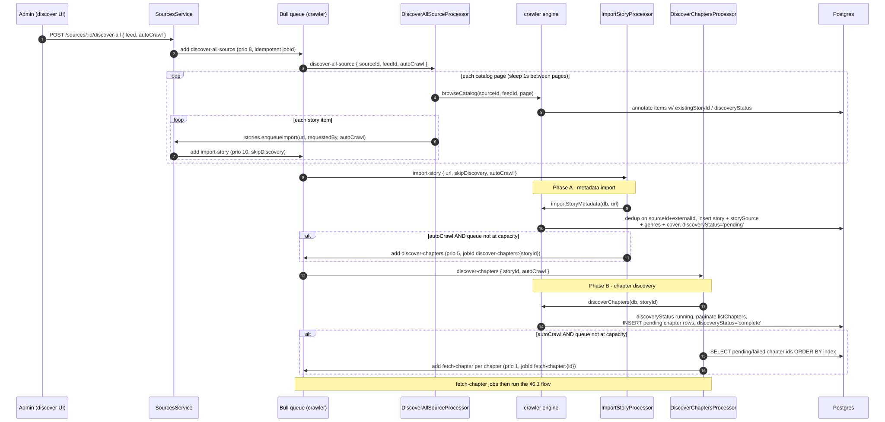
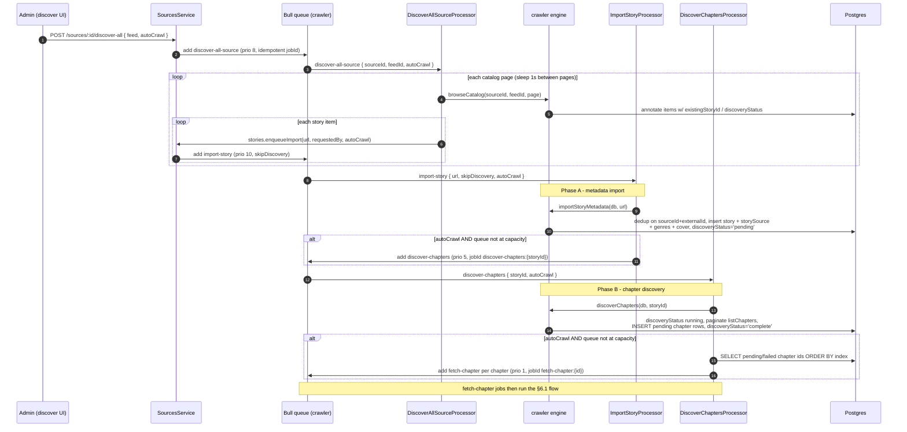
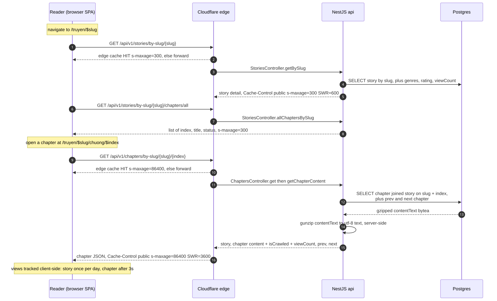
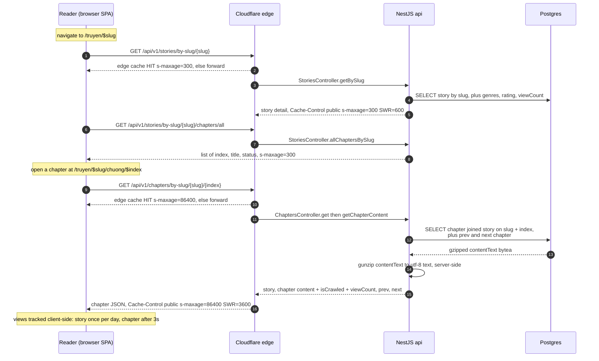
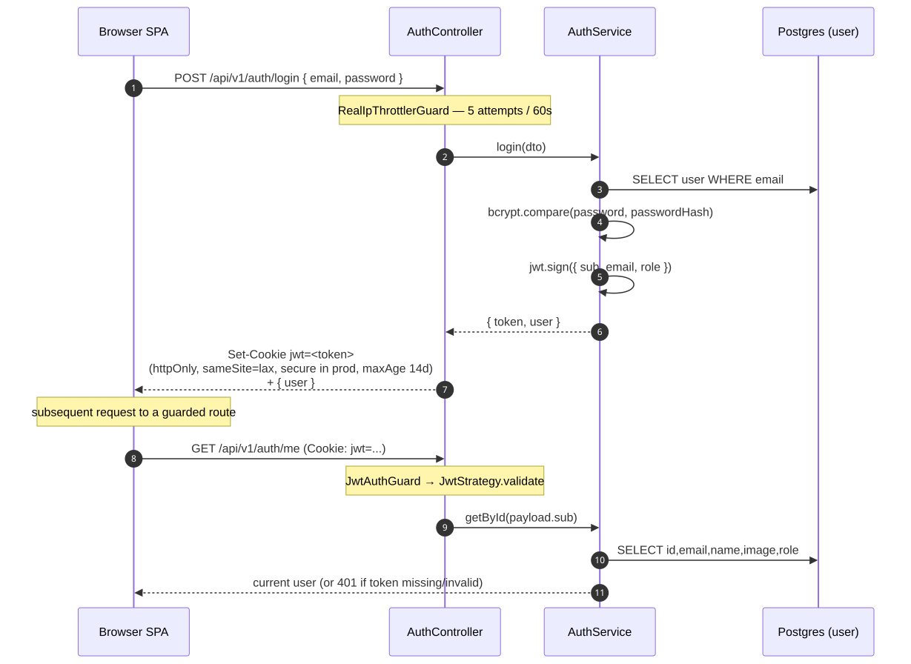
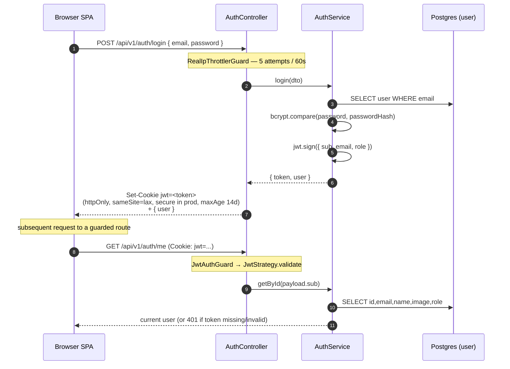
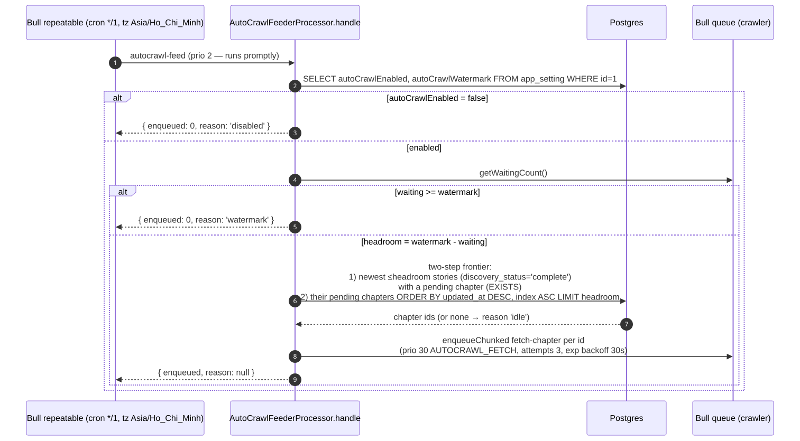
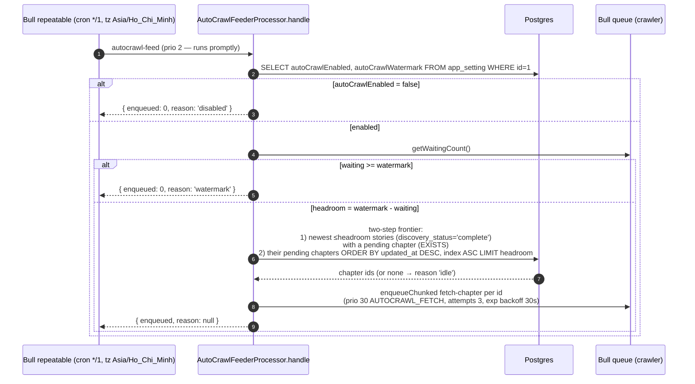

# 6. Runtime View

> arc42 §6 — how the building blocks (§[05](05-building-blocks.md)) collaborate at
> runtime for the scenarios that matter most. SManga runs as a single NestJS
> process (`apps/api`) that is *both* the HTTP server and the Bull worker, plus a
> Vite/React SPA (`apps/frontend`). The flows below are derived from the cited
> source files — every method, job name, column, and endpoint named here was read
> from the code.

The scenarios:

1. [Crawl a chapter](#61-crawl-a-chapter) — content fetch → gzip → persist.
2. [2-step discovery](#62-2-step-discovery-browse--metadata--chapters--crawl) — browse a source feed → import metadata → discover chapters → enqueue crawls.
3. [Reader read path](#63-reader-read-path) — story page → chapter reader → server-side gunzip.
4. [Authentication](#64-authentication) — login → JWT cookie → `/auth/me`.
5. [Smart auto-crawl drainer](#65-smart-auto-crawl-backlog-drainer) — repeatable feeder tops the queue from the backlog.

A note on the queue that recurs throughout: there is **one Bull queue**, named
`crawler` (`QUEUE_CRAWLER`, `apps/api/src/modules/queue/queue.constants.ts`).
All crawl-related work flows through it as jobs of different *names* and
*priorities*. Bull priority is **lower number = higher priority**; the constants
are in `JOB_PRIORITY`:

| Job name (`queue.constants.ts`) | Priority | Meaning |
| --- | --- | --- |
| `fetch-chapter` | 1 (`FETCH_CHAPTER`) | Crawl one chapter's content — the only job that grows the visible library. |
| `retry-reconciler` | 2 (`RETRY_RECONCILER`) | Dead-letter retry sweep / feeder tick. |
| `discover-chapters` | 5 (`DISCOVER_CHAPTERS`) | Discover a story's chapter list. |
| `discover-all-source` | 8 (`DISCOVER_ALL_SOURCE`) | Fan a whole source feed out into imports. |
| `import-story` | 10 (`IMPORT_STORY`) | Import story metadata. |
| `refresh-all-stories` | 20 (`REFRESH_ALL_STORIES`) | Scheduled refresh cron. |
| `autocrawl-feed` enqueues `fetch-chapter` at 30 (`AUTOCRAWL_FETCH`) | 30 | Background backlog drain — lowest priority so manual work always preempts. |

---

## 6.1 Crawl a chapter

**Trigger:** a `fetch-chapter` Bull job (enqueued by discovery chaining, the admin
"crawl" action in `ChaptersService.crawl`, or the auto-crawl feeder). The job
carries only `{ chapterId }` (`FetchChapterJobData`).

**Code:** `FetchChapterProcessor.handle`
(`apps/api/src/modules/crawler-jobs/fetch-chapter.processor.ts`) →
`fetchChapterById(db, chapterId)`
(`packages/crawler/src/engine.ts`) → `fetchHtml`
(`packages/crawler/src/fetcher.ts`), the per-source `TokenBucket`
(`packages/crawler/src/rate-limit.ts`), and the truyenfull adapter's
`fetchChapterContent` → `parseChapterContentHtml`
(`packages/crawler/src/sources/truyenfull/parsers.ts`).

Diagram source (Mermaid)

**Key facts (verified against `engine.fetchChapterById`):**

- The SELECT is deliberately lean — only `id`, `sourceId`, `externalUrl`. The
  gzipped `contentText` bytea is *not* dragged into memory on a re-fetch.
- Rate limiting is a per-`sourceId` `TokenBucket`, default **1 rps** (the burst
  equals the rate). `acquire()` is FIFO-serialized so concurrent callers cannot
  stampede the same deadline (see the `chain` promise in `rate-limit.ts`).
- `chapter.contentText` is stored **gzipped** (`bytea`). `contentByteSize`
  stores the **uncompressed** byte length (used for storage stats). The gzip
  runs via `promisify(zlib.gzip)` so compression happens off the event loop.
- On success: `status='crawled'`, `crawledAt` set, `lastError` cleared. On
  failure: `status='failed'`, `lastError` = the error message, and the error is
  re-thrown so Bull marks the job failed.

**Failure handling / dead-letter:** when Bull exhausts a job's in-process
attempts, `JobFailureListener.onFailed`
(`apps/api/src/modules/jobs/job-failure.listener.ts`) classifies the error
(`classifyCrawlerError` from `@smanga/shared`) and upserts a `job_failure` row:
`permanent` → `needs_attention`; transient → `pending` with a backoff
`nextRetryAt`; beyond `MAX_RETRY_GENERATIONS` → `dead`. `OnQueueCompleted`
resolves the dead-letter row (`status='resolved'`, generation reset to 0). See
[crawling-and-discovery](../business-logic/crawling-and-discovery.md) for the
ParserError taxonomy.

**Cover download** is *not* part of the chapter flow — it happens once during
metadata import (§6.2): `engine.importStoryMetadata` calls `downloadCover`
(`packages/crawler/src/cover.ts`), which fetches the image (also metered through
the per-source bucket), validates the MIME against the allowlist
(`image/jpeg|png|webp|gif`; the non-standard `image/jpg` is normalised to
`image/jpeg`), rejects > 2 MB, and stores the bytes + MIME on the `story` row
(`story.cover` bytea, `story.coverMimeType`). It is served later by the covers
module — see [api reference](../reference/api.md) and
[crosscutting concepts](08-crosscutting-concepts.md) for the caching/ETag story.

---

## 6.2 2-step discovery: browse → metadata → chapters → crawl

The catalog discovery flow separates **metadata import** (Phase A) from
**chapter-list discovery** (Phase B) so a bulk import does not block on
paginating every story's chapter list. An operator can kick this off two ways:

- **Whole feed:** `POST /api/v1/sources/:id/discover-all`
  (`sources.controller.ts` → `SourcesService.enqueueDiscoverAll`) enqueues a
  single `discover-all-source` job (idempotent jobId
  `discover-all:{sourceId}:{feedId}` → 409 if already `waiting`/`active`/`delayed`).
- **Selected URLs:** `POST /api/v1/stories/import-bulk`
  (`stories.controller.ts`) enqueues one `import-story` job per URL.

The full-auto chain is driven by the `autoCrawl` flag carried through the job
payloads (`ImportStoryJobData.autoCrawl` → `DiscoverChaptersJobData.autoCrawl`).

Diagram source (Mermaid)

**Key facts:**

- **Phase A — `importStoryMetadata`** (`engine.ts`): fetches the story page,
  dedups by `(storySource.sourceId, storySource.externalId)` before any
  expensive work, then inserts the `story` row, the `story_source` link
  (`isPrimary=true`), genres (`genre` + `story_genre`), and the cover. The new
  story starts at `discoveryStatus='pending'`. Re-importing an existing story is
  idempotent (returns the existing `storyId`); a NULL cover is healed on
  re-import.
- **Phase B — `discoverChapters`** (`engine.ts`): sets `discoveryStatus='running'`,
  paginates `adapter.buildListChaptersUrl` + `adapter.listChapters` (capped at 200
  pages), inserts `chapter` rows with `status='pending'`
  (`ON CONFLICT DO NOTHING`), then sets `totalChapters`, `discoveredAt`, and
  `discoveryStatus='complete'`. On error it writes `discoveryStatus='failed'` +
  `discoveryError` and re-throws.
- **Capacity guard:** both chaining steps call `isQueueAtCapacity`
  (`apps/api/src/modules/queue/queue-capacity.ts`) before fanning out. If the wait
  queue is saturated the chain is **skipped** — story/chapter rows persist and an
  operator can re-trigger (`discover` or crawl-missing) later. This degradation
  mode exists because of the 2026-06-09 incident where 48k `import-story` jobs
  starved `fetch-chapter`.
- `DiscoverAllSourceProcessor` skips a URL on `ConflictException`/
  `BadRequestException` (e.g. unregistered hostname) instead of failing the whole
  job; any other error fails the job (visible at `/admin/jobs`).

See [crawling-and-discovery](../business-logic/crawling-and-discovery.md) for the
business rules and [api reference](../reference/api.md) for the exact endpoints.

---

## 6.3 Reader read path

The public reader is the Vite/React SPA. It reads via the cacheable, unauthenticated
`/api/v1` story + chapter endpoints. There are **two pages**: the story detail
route `/truyen/$slug` and the chapter reader route `/truyen/$slug/chuong/$index`
(`apps/frontend/src/routes/truyen/$slug/index.tsx` and
`apps/frontend/src/routes/truyen/$slug/chuong/$index.tsx`).

Diagram source (Mermaid)

**Key facts (verified against the controllers/service):**

- Story detail = `GET /api/v1/stories/by-slug/:slug`
  (`StoriesController.getBySlug`). The chapter list the reader uses is
  `GET /api/v1/stories/by-slug/:slug/chapters/all`
  (`allChaptersBySlug`) — the SPA derives the "latest readable chapter" and the
  table of contents from this. Both carry
  `Cache-Control: public, s-maxage=300, stale-while-revalidate=600`.
- Chapter content = `GET /api/v1/chapters/by-slug/:slug/:index`
  (`ChaptersController.get` → `ChaptersService.getChapterContent`). **gunzip
  happens server-side**: the service reads the gzipped `chapter.contentText`
  bytea and `gunzip`s it to UTF-8 before returning (`chapters.service.ts`); the
  client receives plain text. This endpoint carries
  `Cache-Control: public, s-maxage=86400, stale-while-revalidate=3600` (long edge
  TTL — chapter content is effectively immutable once crawled).
- The chapter response also returns `prev`/`next` (queried by `lt`/`gt` on
  `chapter.index`) and `isCrawled` (`status === 'crawled' && text !== null`),
  which the reader uses for navigation and the "chưa được crawl" placeholder.
- View counting is fired from the SPA hooks (`useTrackStoryView` once per
  calendar day; `useTrackChapterView` after 3 s) against the engagement module —
  see [reading-and-engagement](../business-logic/reading-and-engagement.md).

> **Do not** ungzip chapter content client-side — the server route owns it
> (`CLAUDE.md` hard-won workaround #11).

---

## 6.4 Authentication

Auth is **passport-jwt over an httpOnly cookie**. There is no Edge-runtime split
(that was the retired Next.js stack); the NestJS process verifies the JWT on every
guarded request. Code: `apps/api/src/modules/auth/{auth.controller,auth.service,jwt.strategy}.ts`
and the guards in `apps/api/src/common/guards/`.

Diagram source (Mermaid)

**Key facts:**

- `POST /auth/login` (`AuthController.login`) verifies the password with
  `bcryptjs` (`AuthService.login`), signs a JWT (`{ sub, email, role }`,
  `JwtPayload`), and sets it as a cookie named **`jwt`**: `httpOnly`,
  `sameSite: 'lax'`, `secure` only in production, `maxAge` 14 days. Login is rate
  limited to 5 attempts / 60 s by `RealIpThrottlerGuard` + `@Throttle`.
- `JwtStrategy` (`jwt.strategy.ts`) extracts the token from the **`jwt` cookie
  first**, then falls back to the `Authorization: Bearer` header. The secret is
  `JWT_SECRET` (read via `loadEnv()`). `validate` returns
  `{ id, email, role }` → `req.user`.
- `GET /auth/me`, `PATCH /auth/me`, `POST /auth/change-password` are guarded by
  `JwtAuthGuard` (throws on missing/invalid token). Admin-only endpoints add
  `@Roles(['admin'])` enforced by `RolesGuard`, which 403s if `req.user.role` is
  not in the required list. There is also an `OptionalJwtGuard` that populates
  `req.user` if present but never rejects (used for anonymous-friendly routes).
- `POST /auth/logout` simply clears the `jwt` cookie (204).
- **Google OAuth** (optional, `isGoogleEnabled()`): `GET /auth/google` →
  `GET /auth/google/callback`, where `AuthService.findOrCreateOAuthUser` links or
  creates a user, `signTokenFor` issues the same `jwt` cookie, and the user is
  redirected to a validated same-origin path (default `/tu-sach`). See
  [configuration](../reference/configuration.md) for the Google env vars.

---

## 6.5 Smart auto-crawl backlog drainer

A **Bull repeatable job** keeps the wait queue topped up with the
newest-first `pending` chapters at the *lowest* priority, so the existing 1-rps
worker drains the backlog without ever flooding the queue or preempting manual
work. Code: `AutoCrawlFeederProcessor`
(`apps/api/src/modules/app-settings/auto-crawl-feeder.processor.ts`); runtime
toggle in `app_setting` (`packages/db/src/schema/app-setting.ts`), edited via
`PATCH /api/v1/admin/settings/auto-crawl` (`auto-crawl.controller.ts`).

Diagram source (Mermaid)

**Key facts (verified against `auto-crawl-feeder.processor.ts` + the schema):**

- The repeatable is installed on module init with cron **`*/1 * * * *`** (every
  minute, tz `Asia/Ho_Chi_Minh`), jobId `autocrawl-feeder-cron`. The *tick* runs
  at `RETRY_RECONCILER` priority (2) so the queue is refilled before it drains;
  the `fetch-chapter` jobs the tick **enqueues** are `AUTOCRAWL_FETCH` priority
  (30 — the lowest), so any manual crawl/discover/reconciler work preempts them.
- The **kill switch is `app_setting.autoCrawlEnabled`** (default **OFF** /
  opt-in). The repeatable stays installed and simply no-ops (`reason: 'disabled'`)
  when off, so an operator flips it on at `/admin/settings` without a redeploy.
- **`autoCrawlWatermark`** (default **500**, clamped `[50, 2000]` in
  `AppSettingsService.setAutoCrawl`) bounds how many `fetch-chapter` jobs the
  feeder keeps queued. Headroom = `watermark - waiting`; under-filling a tick is
  fine because the next tick continues.
- The **two-step story-frontier** query keeps the outer scan bounded so the
  planner cannot full-sort the large `pending` backlog: step 1 selects the newest
  ≤`headroom` stories (`discovery_status='complete'`) that still have a `pending`
  chapter (early-stops on the story-updated-at index, probes the partial
  needs-crawl index for the `EXISTS`); step 2 takes those stories' `pending`
  chapters ordered by story recency then chapter index, up to `headroom`.
- The whole tick body is wrapped in try/catch and returns
  `{ enqueued: 0, reason: 'error' }` on a transient DB/Redis failure rather than
  crashing the process or leaving a failed feed job in Bull.

See [crawling-and-discovery](../business-logic/crawling-and-discovery.md) and
[admin-and-moderation](../business-logic/admin-and-moderation.md) for the operator
view, and [configuration](../reference/configuration.md) for the `app_setting`
runtime flags.

---

**Related:** building blocks → [05-building-blocks.md](05-building-blocks.md) ·
deployment → [07-deployment-view.md](07-deployment-view.md) · crosscutting
(queue, caching, gzip, auth) → [08-crosscutting-concepts.md](08-crosscutting-concepts.md).
