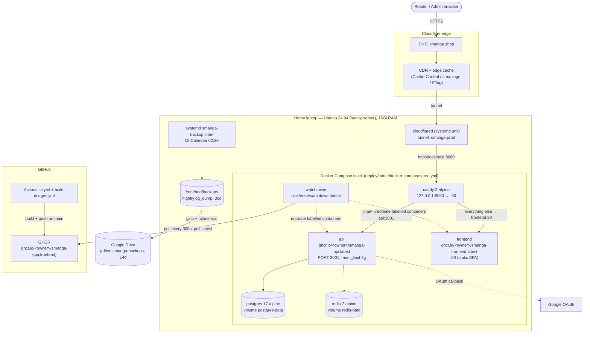
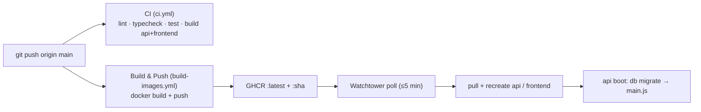
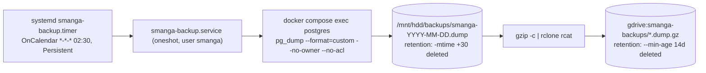

# 7. Deployment View

> arc42 §7 — the technical infrastructure SManga runs on, the mapping of building
> blocks (§5) onto that infrastructure, and how code reaches production.

SManga runs as a **single production environment**: a five-container Docker Compose
stack on a home laptop (Ubuntu 24.04, hostname `sunny-server`), reachable at
`https://smanga.shop` through a Cloudflare Tunnel. There is **no staging tier and no
PR-preview environment** — the Vercel/Railway/Neon/Upstash managed stack (Plan 6) and
the Vercel staging tier were both retired (see [ADR 0006](../adr/0006-laptop-self-host-cloudflare-tunnel.md)).

Authoritative sources for this view:
`deploy/home/docker-compose.prod.yml`, `deploy/home/Caddyfile`,
`deploy/home/cloudflared/config.yml.example`, `deploy/home/scripts/backup.sh`,
`deploy/home/init-db.sh`, `deploy/home/systemd/*`,
`.github/workflows/ci.yml`, `.github/workflows/build-images.yml`, and
[`docs/home-runbook.md`](../home-runbook.md).

---

## 7.1 Deployment diagram

---

## 7.2 Infrastructure nodes

| Node | Role | Key facts |
|---|---|---|
| **Cloudflare** | DNS, TLS termination, edge cache, tunnel ingress | `smanga.shop` apex points at the `smanga-prod` tunnel; edge cache absorbs read load (see §8 caching). |
| **Home laptop (`sunny-server`)** | The single prod host | Ubuntu 24.04, ~15Gi RAM. Power-on auto-boots → Docker daemon → compose stack (`restart: unless-stopped`) → `cloudflared` systemd unit. |
| **`cloudflared`** | Outbound tunnel daemon | Runs as a systemd unit (not in compose). Routes `https://smanga.shop` → `http://localhost:8080`, `connectTimeout: 30s`, `retries: 5`, `grace-period: 30s`. Config template: `deploy/home/cloudflared/config.yml.example`; systemd drop-in `deploy/home/systemd/cloudflared-override.conf` waits for `network-online.target` + `NetworkManager-wait-online.service`. |
| **GitHub Actions / GHCR** | Build and image registry | `ci.yml` gates `main`; `build-images.yml` publishes `ghcr.io/<owner>/smanga-{api,frontend}` tagged `:latest` and `:<sha>`. |
| **`/mnt/hdd/backups`** | Tier-1 backup target | External HDD, mounted `nofail`. Nightly `pg_dump`, 30-day retention. |
| **Google Drive (`gdrive:smanga-backups`)** | Tier-2 off-site backup | Streamed gzip via `rclone`, 14-day retention. |
| **Google OAuth** | Federated sign-in | Callback `https://smanga.shop/api/v1/auth/google/callback` (env `AUTH_GOOGLE_CALLBACK_URL`). |

---

## 7.3 The Compose stack (5 containers)

Defined in `deploy/home/docker-compose.prod.yml`. Every service uses
`restart: unless-stopped`. The default compose project prefix yields container names
like `home-<service>-1`.

| Service | Image | Ports / network | Persistence | Notes |
|---|---|---|---|---|
| **postgres** | `postgres:17-alpine` | internal `5432` | volume `postgres-data` | Tuned via `command` flags (`shared_buffers=1GB`, `effective_cache_size=3GB`, `work_mem=32MB`, `maintenance_work_mem=256MB`, `random_page_cost=1.1`). `mem_limit: 2g`, `stop_grace_period: 30s`. `init-db.sh` mounted at `/docker-entrypoint-initdb.d/init.sh` creates the `unaccent` + `pg_trgm` extensions on first init. Healthcheck `pg_isready`. |
| **redis** | `redis:7-alpine` | internal `6379` | volume `redis-data` | `--save 60 1 --appendonly yes --maxmemory 768mb --maxmemory-policy noeviction`. `mem_limit: 2g` (≈2.5× maxmemory — the comment records a 2026-06-12 OOM-loop when it was 1g). Healthcheck `redis-cli ping`. |
| **api** | `ghcr.io/${GHCR_OWNER}/smanga-api:latest` | internal `3001` | — | NestJS 11. `depends_on` postgres + redis `service_healthy`. `command: pnpm --filter @smanga/db migrate && node apps/api/dist/main.js` — **migrations run on every boot** (see §7.5). `mem_limit: 2g`, `stop_grace_period: 90s`, `NODE_OPTIONS=--max-old-space-size=1024`, `DB_POOL_MAX=25`. Healthcheck `wget -qO- http://localhost:3001/api/v1/health`. Watchtower-managed (label). |
| **frontend** | `ghcr.io/${GHCR_OWNER}/smanga-frontend:latest` | internal `80` | — | Static Vite/React SPA served by its image's web server. `stop_grace_period: 15s`. Watchtower-managed (label). |
| **caddy** | `caddy:2-alpine` | host `127.0.0.1:8080 → 80` | — | The single host-bound port; `cloudflared` connects here. `depends_on: [api, frontend]`. Reverse-proxy rules in §7.4. |
| **watchtower** | `nickfedor/watchtower:latest` | — (mounts `/var/run/docker.sock`) | — | Polls GHCR every `300s` (`WATCHTOWER_POLL_INTERVAL`), `WATCHTOWER_LABEL_ENABLE=true` so it only touches containers carrying `com.centurylinklabs.watchtower.enable=true` (api + frontend), `WATCHTOWER_CLEANUP=true` prunes old images. The `nickfedor` fork is used because upstream `containrrr/watchtower` stalled at v1.7.1 with a Docker API 1.25 client rejected by Docker engine v29+. |

> Only **caddy** binds a host port (`127.0.0.1:8080`). Postgres, Redis, API and the
> frontend are reachable only on the Compose-internal network — nothing else is exposed
> to the LAN or the public internet. All external traffic arrives through Cloudflare → the
> tunnel → caddy.

---

## 7.4 Request routing (Caddy)

`deploy/home/Caddyfile` listens on `:80` and applies, in order:

1. `encode zstd gzip` — response compression.
2. **SEO routes** — `@seo path /sitemap*.xml /robots.txt` → `reverse_proxy api:3001` (these are served by the API outside the `/api/v1` prefix).
3. **API** — `handle /api/*` → `reverse_proxy api:3001`.
4. **Everything else** — `handle { reverse_proxy frontend:80 }` (the SPA).

`admin off` and `auto_https off` are set because TLS is terminated at Cloudflare; Caddy
serves plain HTTP behind the tunnel.

End-to-end path: **Reader → Cloudflare edge → tunnel → `cloudflared` → `localhost:8080`
(Caddy) → api:3001 or frontend:80**.

---

## 7.5 Migration on boot

The api container's start command is
`pnpm --filter @smanga/db migrate && node apps/api/dist/main.js`. The `migrate` script
(`packages/db/package.json` → `tsx src/migrate.ts`) runs the Drizzle migrator before the
Node process starts. This is **idempotent** — Drizzle's journal table tracks applied
migrations, so re-running on every boot (including every Watchtower redeploy) is safe and
applies only new migrations. See [how-to: add a database migration](../how-to/add-a-database-migration.md).

The Postgres extensions (`unaccent`, `pg_trgm`) required by the Vietnamese search index are
created by `deploy/home/init-db.sh` on first database init; the migrations then build the
`immutable_unaccent` wrapper and GIN trigram index (see [§8 Crosscutting Concepts](08-crosscutting-concepts.md)).

---

## 7.6 CI/CD pipeline

- **`ci.yml`** runs on PRs and pushes to `main`: spins up `postgres:16-alpine` + `redis:7-alpine` service containers, then `pnpm install --frozen-lockfile`, `pnpm lint` (Biome), `pnpm typecheck`, `pnpm test`, and builds both `@smanga/api` and `@smanga/frontend`. It is a gate, not a deployer.
- **`build-images.yml`** runs on pushes to `main` that touch `apps/api/**`, `apps/frontend/**`, `packages/**`, `pnpm-lock.yaml`, or the workflow itself (also `workflow_dispatch`). Two parallel jobs build `apps/api/Dockerfile` and `apps/frontend/Dockerfile` with `context: .`, push to GHCR tagged `:latest` and `:${{ github.sha }}`, using GHA build cache. The owner is lowercased for the GHCR path.
- **Deploy is pull-based, not push-based.** Watchtower on the laptop polls GHCR every 300s and recreates the api + frontend containers when `:latest` changes. Expect a 10–20s `503` blip during the api swap (normal — see the runbook's failure table). Manual override and SHA-pin rollback are documented in [`docs/home-runbook.md`](../home-runbook.md) ("Updating the laptop deploy").

> CI uses `postgres:16-alpine` while production runs `postgres:17-alpine`. The major
> version differs between test and prod — worth noting if a migration relies on
> version-specific behaviour.

---

## 7.7 Backups

`deploy/home/scripts/backup.sh` (driven by `smanga-backup.timer` →
`smanga-backup.service`) is dual-tier:

- **Tier 1 (HDD):** custom-format `pg_dump` to `/mnt/hdd/backups/smanga-<date>.dump`; **30-day** retention (`find ... -mtime +30 -delete`). The script `mountpoint -q /mnt/hdd || exit 1` — it refuses to run if the HDD is not mounted, so backups never silently land on the root fs.
- **Tier 2 (off-site):** `gzip -c "$DUMP" | rclone rcat gdrive:smanga-backups/...` (no temp file on root fs); **14-day** retention (`rclone delete --min-age 14d`). Requires an `rclone` remote named `gdrive`.

The timer is `Persistent=true`, so a missed run (laptop off at 02:30) executes on next
boot. Restore procedures live in [`docs/home-runbook.md`](../home-runbook.md)
("Restore from … backup" and "Recovery when the laptop is unavailable").

> The off-site target is **Google Drive** (`gdrive:smanga-backups`), per `backup.sh`. Some
> systemd-unit descriptions and the runbook's restore example still reference an "R2"
> remote — those strings are stale; the live remote is `gdrive`.

---

## 7.8 Failure modes and recovery (summary)

| Symptom | Cause | First action |
|---|---|---|
| Cloudflare `522` | Tunnel up, origin down | `docker compose ps` → restart services |
| Cloudflare `530` | Tunnel itself down | `sudo systemctl restart cloudflared` |
| `502` from Caddy | api container unhealthy | `docker compose logs api` → fix → restart |
| `503` burst at deploy | Watchtower recreating api | Normal, ~10–20s blip |
| Backup fails "HDD not mounted" | `/mnt/hdd` unmounted | `mount /mnt/hdd`, then re-run the service |
| Laptop dead/unreachable | Single host SPOF | Provision new host, follow Plan 9 install order, restore latest Google Drive dump, re-point the tunnel DNS |

The home laptop is a **single point of failure on a residential ISP** — an accepted
trade-off for a hobby project (see [§9 Quality and Risks](09-quality-and-risks.md) and
[ADR 0006](../adr/0006-laptop-self-host-cloudflare-tunnel.md)). The full operational
playbook is [`docs/home-runbook.md`](../home-runbook.md); local-dev and admin
bootstrap live in [`docs/operations.md`](../operations.md).

---

← [6. Runtime View](06-runtime-view.md) · [Architecture index](00-index.md) · [8. Crosscutting Concepts](08-crosscutting-concepts.md) →
