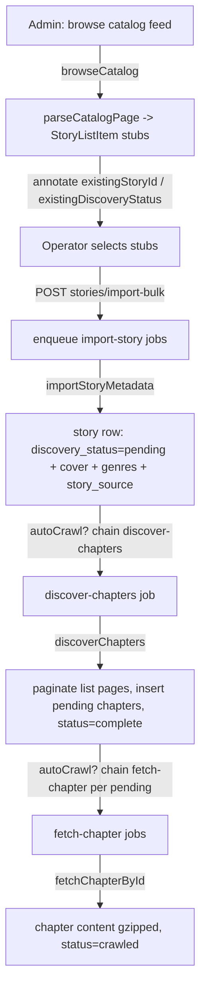
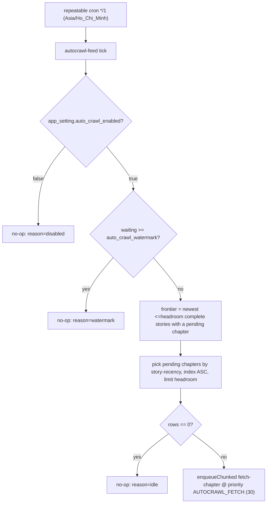
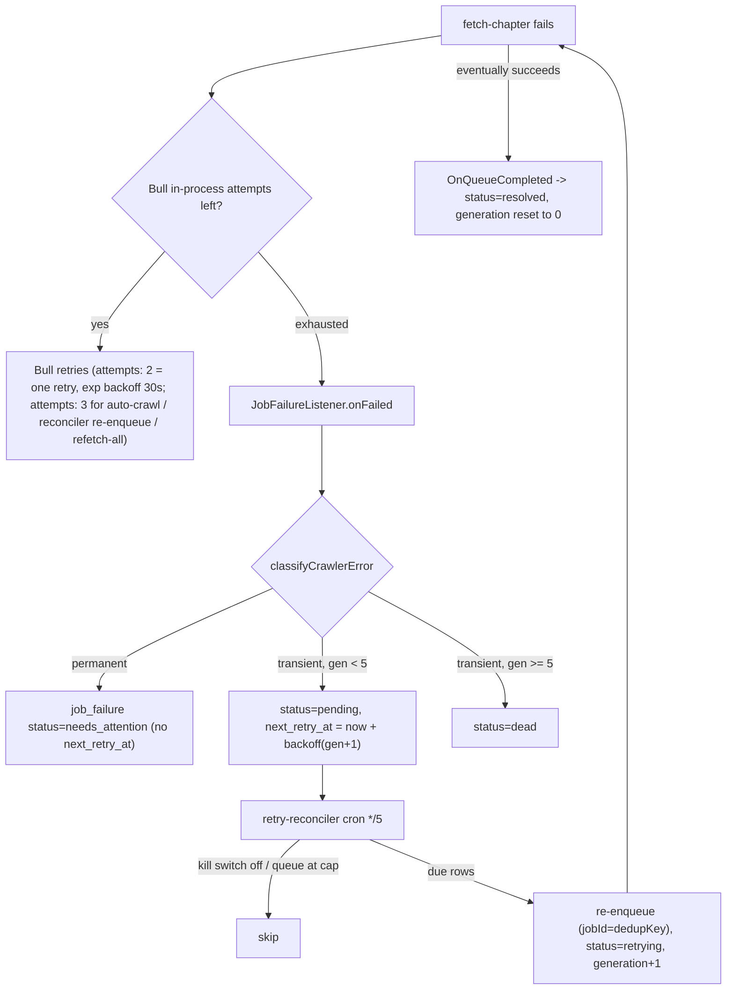

# Crawling & Discovery

> **Explanation** — the business rules behind getting novels into SManga:
> the source-adapter contract, rate limiting, the two-step discovery flow,
> the smart auto-crawl drainer, and how failures are classified, retried, and
> dead-lettered. Code lives in `packages/crawler/src/*`,
> `apps/api/src/modules/crawler-jobs/*`, `apps/api/src/modules/jobs/*`, and
> `apps/api/src/modules/app-settings/*`. The contract types are in
> `packages/shared/src/{adapter,errors,retry-policy}.ts`.

## The `SourceAdapter` contract

A crawl source is a folder under `packages/crawler/src/sources/<id>/`
implementing the `SourceAdapter` interface (`packages/shared/src/adapter.ts`).
The defining rule: **adapter methods take HTML strings, not URLs.** The engine
owns all I/O — fetching, rate limiting, retries, persistence, cover download —
so adapters are pure HTML→data parsers that are trivially testable against
committed fixtures.

The interface (verbatim shape):

- Metadata: `id`, `name`, `baseUrl`, `hostnames[]`, `requiresJs`,
  `rateLimit: { rps }`.
- Per-story parse: `parseStoryFromUrl(url, html)`, `listChapters(html)`,
  `fetchChapterContent(html)`, plus the URL builder `buildListChaptersUrl(storyUrl, page)`.
- Catalog (mandatory): `catalogFeeds[]`, `buildCatalogUrl(feedId, page)`,
  `parseCatalogPage(html, feedId, page)`.
- Search (optional): `buildSearchUrl?` / `parseSearchPage?` — a source without a
  search endpoint simply omits them, and `searchCatalog` throws if they are
  missing.

Adapters self-register in a process-wide registry (`registry.ts`):
`registerAdapter` indexes by `id` and by each lowercased hostname;
`resolveAdapterForUrl` looks up by URL host; `getAdapter` by id. A missing
lookup throws `AdapterNotFoundError`.

`requiresJs` is the escape hatch for sources that need a headless browser.
truyenfull serves static HTML, so its adapter sets `requiresJs: false` and the
engine uses the cheerio fetcher — see
[ADR 0004](../adr/0004-cheerio-first-crawler.md).

### truyenfull adapter quirks

The one shipped adapter (`packages/crawler/src/sources/truyenfull/index.ts` +
`parsers.ts`) encodes selector knowledge that diverged from "obvious" patterns —
each is a real bug fix, not arbitrary:

- **Chapter index from the URL slug, not the title.** `parseChapterListHtml`
  matches `chuong-(\d+(?:-\d+)?)` against the last path segment and converts
  `12-5` → `12.5`. Title text is unreliable.
- **`hasNextPage` via the `glyphicon-menu-right` arrow** (and Vietnamese
  "sau"/"tiếp"/"next"), **never** `href.includes('/trang-')` — previous-page
  links also contain `/trang-`, which would cause infinite pagination on the
  last page.
- **Chapter title selector is `a.chapter-title`**, not `.chapter-title`.
- **Block-separator insertion before `.text()`** in both the description and
  chapter-content parsers, because cheerio's `.text()` fuses adjacent `
`/` `
  blocks (e.g. "côngThẩm").
- **Cover MIME normalisation**: truyenfull's CDN serves the non-standard
  `image/jpg`; `downloadCover` (`cover.ts`) rewrites it to `image/jpeg` before
  the allowlist check (`image/jpeg|png|webp|gif`, ≤ 2 MB).

The adapter exposes three catalog feeds: `newest` (Mới cập nhật), `hot`
(Truyện hot), `completed` (Đã hoàn thành) at rps 1.

## Rate limiting — one token bucket per source

The engine meters every outbound request through a `TokenBucket`
(`rate-limit.ts`) keyed by `sourceId`, at the source's configured `rps`
(default 1). The bucket is a **FIFO gate**: each `acquire()` awaits the previous
caller before competing for a token, then loops (refill → take a token, or sleep
the exact deficit). This serialisation fixed a thundering-herd bug where all
concurrent processor types woke on the same deadline and burst 4–6 requests,
tripping truyenfull's 503 (which had forced rps down to 0.5). With the fix,
sustained 1 rps is safe again. The bucket is recreated when a source's rps
changes.

One *import* costs **two** tokens (metadata fetch + cover fetch), both metered
through the same bucket, so it can never burst past the per-source rps.

## Two-step discovery

Importing a story is split into two phases so a bulk catalog import can persist
hundreds of cheap metadata stubs without paying for chapter-list pagination up
front (Plan 7, `2026-05-30-smanga-catalog-discovery.md`).

- **Phase A — `importStoryMetadata`** fetches the story page, dedups by
  `(sourceId, externalId)` against `story_source` *before* any cover download,
  then persists the `story` row (`discovery_status='pending'`), cover, genres,
  and the primary `story_source` link. Re-importing an existing URL is
  idempotent and also heals a missing cover (stub stories whose cover is NULL).
- **Phase B — `discoverChapters`** sets `discovery_status='running'`, paginates
  the chapter-list pages via `buildListChaptersUrl`, inserts `pending` chapter
  rows with `ON CONFLICT DO NOTHING` (dedup on `chapter_story_index_uniq`), and
  finishes at `complete` (recording `total_chapters`, `discovered_at`) or
  `failed` (recording `discovery_error`). Pagination is capped at 200 pages.
- **Phase C — `fetchChapterById`** (per chapter) fetches the chapter HTML,
  parses content, gzips it, and writes `content_text` + `content_byte_size` with
  `status='crawled'`; on error it writes `status='failed'` + `last_error`.

The **autoCrawl chain** wires these together: an `import-story` job carrying
`autoCrawl: true` chains `discover-chapters`, which in turn chains one
`fetch-chapter` per pending chapter — one operator click can fully crawl a
story. Each chain step uses an idempotent Bull `jobId`
(`discover-chapters:<storyId>`, `fetch-chapter:<chapterId>`) and is skipped if
the queue is at capacity (the metadata is already safe; the operator re-triggers
later).

### Content storage: gzip in, gunzip out, dedup throughout

- `fetchChapterById` gzips the parsed text (`zlib.gzip`, off the event loop) and
  stores it in `content_text` bytea; `content_byte_size` holds the *uncompressed*
  length. The reader side gunzips server-side
  (`apps/api/src/modules/chapters/chapters.service.ts`) — clients never see the
  compressed bytes. See
  [`reading-and-engagement.md`](./reading-and-engagement.md).
- **Dedup** happens at three layers: stories on `(sourceId, externalId)` before
  import; chapters on `(story_id, index)` via the unique index; covers via the
  re-import heal path.

## Smart auto-crawl backlog drainer

A Bull repeatable job tops up the queue with the lowest-priority work so the
single 1-rps worker steadily drains the crawl backlog without ever flooding the
queue or preempting operator-initiated work
(`apps/api/src/modules/app-settings/auto-crawl-feeder.processor.ts`, spec
`2026-06-12-smart-auto-crawl-design.md`).

Key business rules:

- **Off by default.** `auto_crawl_enabled` defaults to `false`; an operator must
  flip it on in `/admin/settings`.
- **Watermark-bounded.** Each tick only fills the queue up to
  `auto_crawl_watermark` (default 500, clamped `[50, 2000]` in the DTO) — the
  bound that makes it non-disruptive. If `waiting >= watermark`, the tick is a
  no-op.
- **Newest-first, two-step frontier.** The picker first selects the newest
  ≤`headroom` `complete` stories that still have a `pending` chapter
  (early-stopping on `story_updated_at_idx`, probing the partial
  `chapter_needs_crawl_idx`), then takes those stories' pending chapters in
  `(story-recency, index ASC)` order. This keeps the outer scan bounded instead
  of full-sorting the entire pending backlog.
- **Lowest priority.** Enqueued at `JOB_PRIORITY.AUTOCRAWL_FETCH = 30`, so
  manual crawl-missing, "Chỉ crawl lỗi", discovery, and the reconciler always
  preempt it.
- **Self-installing & guarded.** The repeatable is reinstalled on boot (cleaning
  any stale copy) and the whole tick body is wrapped so a transient DB/Redis
  error logs and returns rather than crashing the process.

## Queue priorities

Bull priority is **lower = higher** (`queue.constants.ts`). The ordering exists
because a flood of `import-story` jobs once starved `fetch-chapter` for hours
(the 2026-06-09 incident: 48k imports ahead of 357 fetches → zero chapters
crawled in 24h).

| Priority | Job | Why |
|---|---|---|
| 1 | `fetch-chapter` | The only job that grows the visible library |
| 2 | `retry-reconciler` | Cheap cron tick; runs promptly |
| 5 | `discover-chapters` | Single cheap fetch; prerequisite for crawling |
| 8 | `discover-all-source` | Rare admin action; fans out into N imports |
| 10 | `import-story` | Setup step, no user-visible payoff |
| 20 | `refresh-all-stories` | Scheduled cron; deferrable |
| 30 | `autocrawl-feed` (enqueued `fetch-chapter`) | Background drain; always preempted |

## Failure classification, retry, and dead-letter

Crawler errors are a small taxonomy (`packages/shared/src/errors.ts`), all
extending `CrawlerError`:

- `FetchError` — HTTP/network failure, carries an optional `statusCode`.
- `RateLimitError`, `ParserError`, `AdapterNotFoundError`.

`classifyCrawlerError` (`retry-policy.ts`) maps each to a `FailureClass`:

- **transient** → `RateLimitError`, network `FetchError` (no status), and
  `FetchError` with `408` or `5xx` (upstream hiccups). Worth retrying.
- **permanent** → `ParserError` (e.g. empty content / VIP-locked / changed
  DOM), `AdapterNotFoundError`, `FetchError` with a `4xx` (gone / forbidden),
  and any unknown error. Surfaced for operator attention, not auto-retried.

### Two-tier retry

1. **Bull in-process retry** — fine-grained. The standard chained `fetch-chapter`
   job inherits the queue's `defaultJobOptions` (`queue.module.ts`):
   `attempts: 2` (i.e. one retry) with exponential backoff (`delay: 30_000`). The
   `discover-chapters → fetch-chapter` chain enqueues with only `{ jobId, priority }`
   (`discover-chapters.processor.ts`), so it inherits this `attempts: 2`. Only three
   paths override to `attempts: 3`: the auto-crawl feeder
   (`auto-crawl-feeder.processor.ts`), the dead-letter reconciler's re-enqueue, and
   `refetch-all-chapters`.
2. **Postgres dead-letter + reconciler** — coarse-grained and durable. When
   Bull's attempts are exhausted, `JobFailureListener.onFailed`
   (`apps/api/src/modules/jobs/job-failure.listener.ts`) upserts a `job_failure`
   row keyed by a natural `dedup_key` (`fetch-chapter:<chapterId>`,
   `discover-chapters:<storyId>`, `import-story:<url>` — only these three are
   retryable; orchestrators are excluded). Per-generation backoff ladder is
   `10m / 30m / 2h / 6h / 24h` (`RETRY_BACKOFF_MINUTES`); after generation 5 the
   row goes `dead`. The `retry-reconciler` cron (every 5 min,
   `retry-reconciler.service.ts`) picks `pending` rows whose `next_retry_at <= now`
   (cap 200/run), re-enqueues with the dead-letter key as the Bull jobId, and
   optimistically flips the row to `retrying` (generation +1). On a later
   successful run, `OnQueueCompleted` marks the row `resolved` and resets the
   generation to 0 (resolution is the episode boundary).

The reconciler honours two safety gates: the `auto_retry_enabled` kill switch
(default ON — flip off to halt auto-retry during an incident) and a
queue-at-capacity skip so it never piles onto a backed-up queue.

See [`admin-and-moderation.md`](./admin-and-moderation.md) for the operator-facing
dead-letter panel and the [runtime view](../architecture/06-runtime-view.md) for
sequence diagrams.
