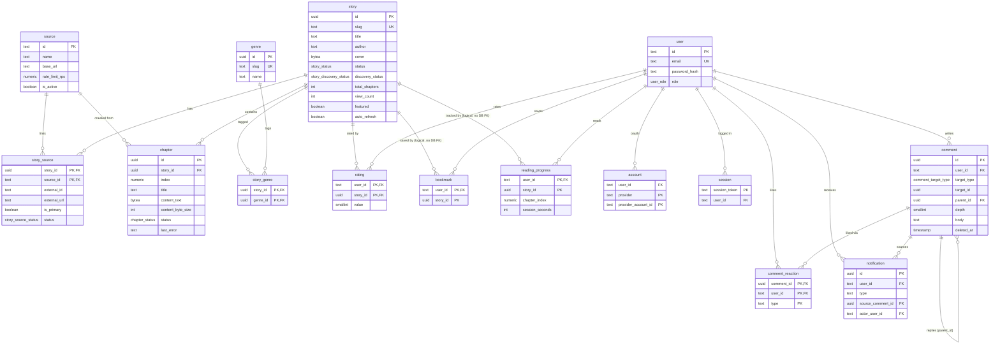
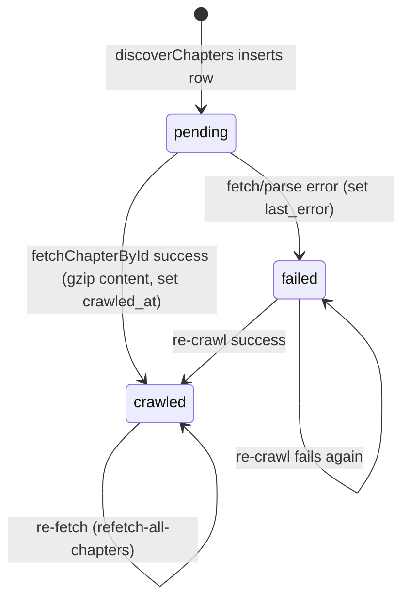
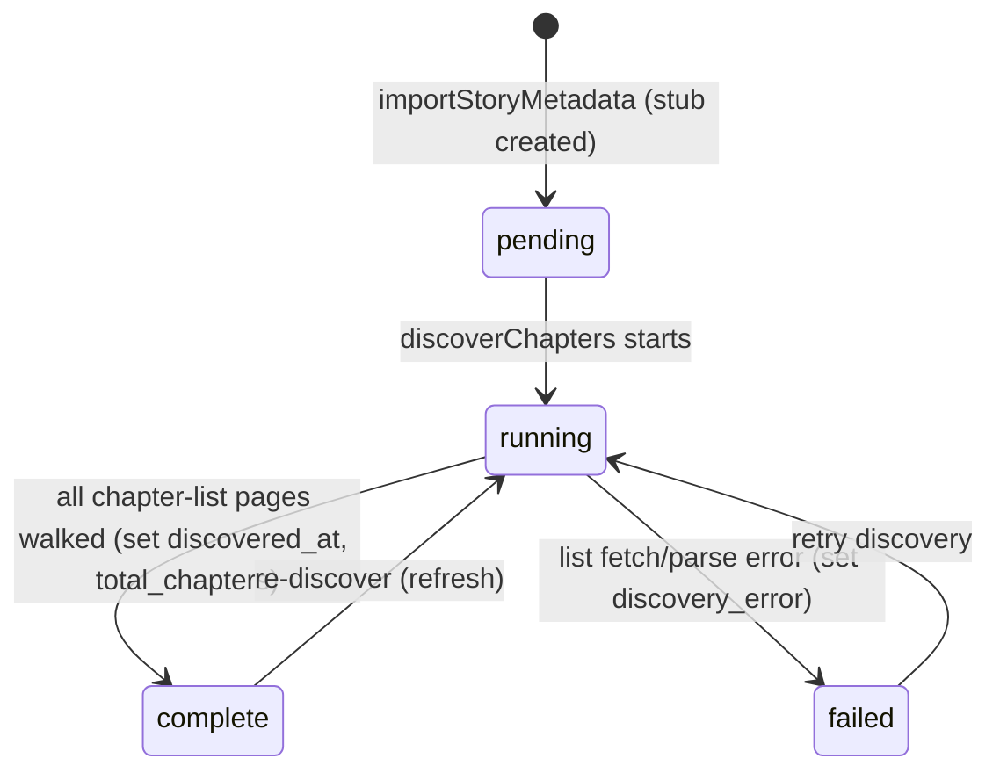

# Domain Model

> **Explanation** — the entities SManga stores and how they relate. Every table,
> column, and enum named here is defined in `packages/db/src/schema/*.ts`. For a
> column-by-column field reference (types, nullability, indexes) see
> [`../reference/data-model.md`](../reference/data-model.md).

SManga is a Vietnamese novel reader. The domain divides cleanly into three
clusters:

- **Catalog** — what gets crawled and read: `source`, `story`, `story_source`,
  `genre`, `story_genre`, `chapter`.
- **Identity & reading** — who reads and what they did: `user`, `account`,
  `session`, `verification_token`, `bookmark`, `reading_progress`, `rating`,
  `comment`, `comment_reaction`, `notification`.
- **Operations** — how the crawl is run and recovered: `job_failure`,
  `app_setting`.

The schema files are wired into the barrel `packages/db/src/schema/index.ts`
(the order there is also the order the migrations create the types).

## Entity-relationship diagram

> The diagram omits the standalone operational tables `job_failure` and
> `app_setting` — neither carries a foreign key. They are described in their own
> sections below.

## Entities

### Catalog

**`source`** (`source.ts`) — a crawlable site. Primary key is a text id
(`'truyenfull'`). Carries `name`, `base_url`, an `is_active` flag, and
`rate_limit_rps` (numeric, default `'1'`). A `source` is never deleted while a
`chapter` or `story_source` references it (`onDelete: 'restrict'`).

**`story`** (`story.ts`) — a novel. Identified internally by a `uuid` and
publicly by a unique `slug`. Holds presentation fields (`title`, `author`,
`description`, `cover` bytea + `cover_mime_type`), the reading-status enum
`status` (`story_status`), denormalised counters (`total_chapters`,
`view_count`), curation flags (`featured`, `auto_refresh`), and the discovery
state machine fields (`discovery_status`, `discovery_error`, `discovered_at`).
Three indexes back the hot paths: a GIN trigram search index
`story_search_idx` over `immutable_unaccent(lower(title || ' ' || coalesce(author, '')))`
(the `coalesce` is load-bearing: `author` is nullable, and without it a NULL author
would null the whole concatenation), an
`updated_at DESC` index for the public list top-N, and a `last_chapter_at`
index.

**`story_source`** (`story.ts`) — the many-to-many link between a story and the
source(s) it was crawled from. Composite primary key `(story_id, source_id)`,
plus a unique index `story_source_external_idx` on `(source_id, external_id)`
which is the dedup key the crawler checks before importing. `is_primary` marks
the source used for chapter discovery; `status` is `story_source_status`
(`active` / `unavailable`).

**`genre`** / **`story_genre`** (`story.ts`) — thể loại (genre) catalog and its
join table. `genre` has a unique `slug`; `story_genre` is a composite PK
`(story_id, genre_id)`.

**`chapter`** (`chapter.ts`) — one chương (chapter) of a story. `index` is a
`numeric(10,2)` (decimals support inserted/split chapters like `12.5`), unique
per story via `chapter_story_index_uniq`. `content_text` is **gzipped bytea**
(see [`crawling-and-discovery.md`](./crawling-and-discovery.md)); `content_byte_size`
stores the *uncompressed* length for stats. `status` is `chapter_status`
(`pending` / `crawled` / `failed`) with `last_error` recording the last failure
message. A partial index `chapter_needs_crawl_idx` on `story_id`
`WHERE status IN ('pending','failed')` turns "does this story still need
crawling?" into an empty-range index probe.

### Identity & reading

**`user`** (`auth.ts`) — text PK, unique `email`, optional `password_hash`
(null for OAuth-only accounts), and `role` (`user_role`: `user` / `admin`).
**`account`** stores linked OAuth providers (composite PK
`(provider, provider_account_id)`); **`session`** and **`verification_token`**
are the Auth.js-shaped tables retained from the original schema.

**`bookmark`** (`user-data.ts`) — a saved story. Composite PK `(user_id,
story_id)` — at most one bookmark per user per story. Only `user_id` is a DB
foreign key; `story_id` is a plain `uuid` with **no** `references()` constraint
(a logical-only link, like `comment.target_id`).

**`reading_progress`** (`user-data.ts`) — **one row per (user, story)** tracking
the furthest `chapter_index` reached plus accumulated `session_seconds`. The
composite PK enforces the single-row-per-story rule. As with `bookmark`, only
`user_id` is a DB FK; `story_id` carries no `references()` constraint. See
[`reading-and-engagement.md`](./reading-and-engagement.md).

**`rating`** (`engagement.ts`) — a 1–5 star rating, composite PK `(user_id,
story_id)` (one per user per story), with a DB-level `CHECK (value BETWEEN 1
AND 5)` (`rating_value_range`) backing the API validation.

**`comment`** (`comment.ts`) — a polymorphic comment tree. `target_type`
(`comment_target_type`: `story` / `chapter`) + `target_id` form a *polymorphic*
foreign key (no DB-level `references()` — existence is validated in the
service). `parent_id` self-references `comment.id` for replies; `depth` is a
`smallint` with `CHECK (depth BETWEEN 1 AND 3)` (`comment_depth_range`).
`deleted_at` is a soft-delete tombstone. **`comment_reaction`** is a like toggle
(composite PK `(comment_id, user_id, type)`, type defaults to `'like'`).
**`notification`** records `comment_reply` / `comment_mention` events for a
target user.

> **Note:** there is **no separate view/event table.** "Views" are simple
> `view_count` integer columns on `story` and `chapter`, incremented in place
> (see [`reading-and-engagement.md`](./reading-and-engagement.md)).

### Operations

**`job_failure`** (`job-failure.ts`) — the Postgres-backed dead-letter queue for
crawler jobs, one row per unit of work keyed by a unique `dedup_key`. It is the
durable "retry brain" that survives Redis trimming and restarts. Drives the
reconciler via the enums `job_failure_class` (`transient` / `permanent`) and
`job_failure_status` (`pending` / `retrying` / `needs_attention` / `dead` /
`resolved`). See [`crawling-and-discovery.md`](./crawling-and-discovery.md).

**`app_setting`** (`app-setting.ts`) — a single-row table (`CHECK (id = 1)`)
holding runtime-tunable operator config: the scheduled auto-refresh policy
(`auto_refresh_enabled`, `auto_refresh_cron`, `auto_refresh_scope`,
`auto_refresh_concurrency`), the dead-letter retry kill switch
(`auto_retry_enabled`, default ON), and the smart auto-crawl drainer
(`auto_crawl_enabled` default OFF, `auto_crawl_watermark` default 500). See
[`admin-and-moderation.md`](./admin-and-moderation.md) and
[`../reference/configuration.md`](../reference/configuration.md).

## State machines

### Chapter lifecycle (`chapter.status`, enum `chapter_status`)

A chapter row is created in `pending` during discovery, then transitions when
`fetchChapterById` runs (`packages/crawler/src/engine.ts`).

`pending` and `failed` are exactly the two states the partial index
`chapter_needs_crawl_idx` and the auto-crawl feeder treat as "needs crawl".

### Story discovery lifecycle (`story.discovery_status`, enum `story_discovery_status`)

A story is imported metadata-only as `pending` (a "stub"), then chapter
discovery walks it through `running` to `complete` or `failed`
(`importStoryMetadata` / `discoverChapters` in `packages/crawler/src/engine.ts`).

Only `complete` stories are eligible for the auto-crawl backlog drainer and the
scheduled refresh.
