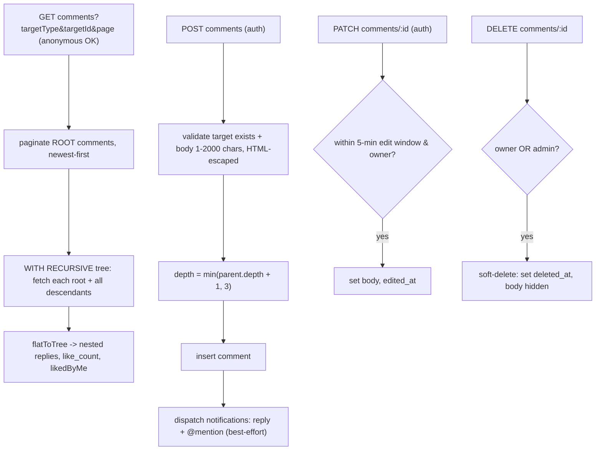

# Reading & Engagement

> **Explanation** — what readers do once a story is crawled: read chapters,
> track progress, bookmark, rate, comment, and how the site surfaces
> recommendations and rankings. Code lives in
> `apps/api/src/modules/{chapters,engagement,recommendations,rankings,comments,user-data}/*`
> over the `user-data`, `engagement`, and `comment` schemas. For the REST
> surface see [`../reference/api.md`](../reference/api.md).

## Reading a chapter

`ChaptersService.getChapterContent` (`apps/api/src/modules/chapters/chapters.service.ts`)
resolves a chapter by `(story.slug, chapter.index)`, joins the parent story, and
**gunzips `content_text` server-side** (`zlib.gunzip`, with a raw-buffer
fallback if the bytes aren't gzipped). Clients always receive plain text — never
the compressed bytea. It also returns the prev/next chapter index for reader
navigation. This is the read counterpart to the gzip-on-write described in
[`crawling-and-discovery.md`](./crawling-and-discovery.md).

## Reading progress

`reading_progress` (`packages/db/src/schema/user-data.ts`) is keyed by the
composite primary key `(user_id, story_id)` — **exactly one furthest-read row
per user per story.** `ReadingProgressService`
(`apps/api/src/modules/user-data/reading-progress.service.ts`):

- `upsert(userId, storyId, chapterIndex)` writes the latest chapter via
  `ON CONFLICT (user_id, story_id) DO UPDATE`.
- `addSession` accumulates reading time (`session_seconds += seconds`) and
  advances the chapter monotonically with
  `GREATEST(chapter_index, :new)` so a backward navigation never rewinds the
  furthest-read marker.
- `getContinueReading` returns the single most-recently-updated row (the home
  "continue reading" widget); `list` returns all progress rows newest-first for
  the personal library.

## Bookmarks

`bookmark` is keyed `(user_id, story_id)`, so at most one bookmark per story.
`BookmarksService` (`bookmarks.service.ts`) uses `onConflictDoNothing` on add
(idempotent), a plain delete on remove, and `has` for the toggle button state.
`list` joins each bookmarked story with its rating aggregate for the library
cards.

## Ratings

`rating` (`engagement.ts`) is a 1–5 `smallint` keyed `(user_id, story_id)` —
**one rating per user per story** — with a DB `CHECK (value BETWEEN 1 AND 5)`.
`EngagementService` (`engagement.service.ts`):

- `upsertRating` inserts-or-updates via `onConflictDoUpdate` on the composite
  key, then returns the fresh aggregate.
- `getRatingAggregate` computes `avg(value)::numeric(3,2)` and `count(*)` plus
  the caller's own `mine` value (null when anonymous).
- `deleteRating` is idempotent (no 404 if absent) and returns the recomputed
  aggregate with `mine = null`.

The frontend updates optimistically and reconciles against the returned
`{ avg, count, mine }`.

## View counting

There is **no per-event or per-day view table.** Views are flat `view_count`
integer columns on `story` and `chapter`, incremented in place:

```sql
UPDATE story   SET view_count = view_count + 1 WHERE id = :storyId;
UPDATE chapter SET view_count = view_count + 1 WHERE id = :chapterId;
```

The endpoints (`ViewsController`, `views.controller.ts`,
`POST /api/v1/views/story/:storyId` and `/chapter/:chapterId`) are fire-and-forget (HTTP
204) and throttled to **30 requests/min per IP** to bound F5 spam, on top of the
global 120/min throttle. `view_count` feeds the "Lượt xem" ranking below.

## Recommendations

`RecommendationsService` (`recommendations.service.ts`) is content-based on
shared genres — no ML, just SQL over `story_genre`.

- **Similar** (public, `getSimilar`) — for a given story, ranks other stories by
  count of shared genres, then rating, view count, recency. The reason string is
  `Cùng thể loại <genre>`. If the anchor has no genres or no matches, it falls
  back to a global-popular list (reason `Đang được yêu thích`).
- **For You** (auth-only, `getForYou`) — builds the user's genre weights from
  their `bookmark` ∪ `reading_progress` history, scores unread stories by summed
  weight, and excludes anything already in their history. Reason is
  `Vì anh đã đọc <sample title>`. **Empty history yields an empty list — there is
  no popular fallback for For You** (by design, spec).

## Rankings (Bảng xếp hạng)

`RankingsService` (`rankings.service.ts`) exposes four boards, each with its own
metric and ordering:

| Board | Metric | Rules |
|---|---|---|
| **Hot tuần này** (`getHot`) | `COUNT(DISTINCT reading_progress.user_id)` over the last 7 days | Top-N fixed (no pagination); joins `reading_progress` where `updated_at > now() - 7 days` |
| **Lượt xem** (`getViews`) | `story.view_count` | All-time, paginated |
| **Điểm đánh giá** (`getRating`) | `avg(rating.value)` | Paginated, `HAVING count(*) >= 3` (minimum-votes guard) |
| **Mới hoàn thành** (`getCompleted`) | `total_chapters` | `WHERE status = 'completed'`, ordered by recency |

The "hot" metric is **weekly distinct readers from `reading_progress`**, not the
raw `view_count` — reading activity, not page hits.

## Comments

`CommentsService` (`comments.service.ts`) implements a polymorphic, threaded,
moderated comment system over the `comment` / `comment_reaction` / `notification`
tables.



Business rules:

- **Tree depth is capped at 3** (DB `CHECK` + service clamp). A reply's depth is
  `min(parent.depth + 1, 3)`.
- **Pagination is over root comments only**; the full reply subtree for each
  page of roots is fetched in one recursive CTE, then assembled in memory.
  Anonymous users can list (the global optional-JWT guard sets `user = null`);
  posting requires auth.
- **Body** is trimmed, length-checked (1–2000 chars), and HTML-escaped
  (`&`/`<`/`>`) before insert.
- **Edit window**: a comment is editable only by its owner and only within 5
  minutes of creation; edits stamp `edited_at`.
- **Soft delete**: owner *or* an `admin` can delete; the row is tombstoned via
  `deleted_at` and its body is nulled in responses (replies remain).
- **Reactions** are a like toggle (`POST .../react`) — insert-or-delete on
  `comment_reaction`, returning the fresh `likeCount` + `likedByMe`.
- **@mentions & replies** generate `notification` rows (`comment_mention` /
  `comment_reply`) for the mentioned/replied-to user (best-effort — notification
  failure never breaks comment creation, and self-notifications are skipped).
- **Throttling**: create 10/hr, edit 20/hr, react 30/hr per principal.

Comment moderation from the operator side is covered in
[`admin-and-moderation.md`](./admin-and-moderation.md).
