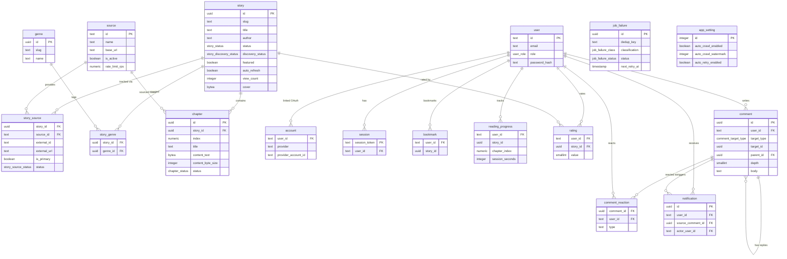

# Data Model Reference

Complete table-by-table reference derived from `packages/db/src/schema/*.ts` and the Drizzle migration journal under `packages/db/src/migrations/`.

---

## Import convention and drizzle.config.ts

**Cross-schema imports inside `packages/db/src/schema/` use `.ts` extensions** (not `.js`). This is required because `drizzle-kit`'s CJS bundler cannot resolve `.js` ESM back-references to TypeScript source files. Consumer packages (and the schema barrel `index.ts`) still use `.js` extensions as usual.

`packages/db/drizzle.config.ts` lists schema files as an **explicit array**, not a glob:

```ts
schema: [
  './src/schema/enums.ts',
  './src/schema/source.ts',
  './src/schema/story.ts',
  './src/schema/chapter.ts',
  './src/schema/auth.ts',
  './src/schema/user-data.ts',
  './src/schema/app-setting.ts',
  './src/schema/engagement.ts',
  './src/schema/comment.ts',
  './src/schema/job-failure.ts',
]
```

When adding a new schema file, append it to this array.

---

## Enums

Source: `packages/db/src/schema/enums.ts`

| Enum name (Postgres type) | Values |
|---|---|
| `story_status` | `ongoing`, `completed`, `dropped`, `unknown` |
| `story_source_status` | `active`, `unavailable` |
| `chapter_status` | `pending`, `crawled`, `failed` |
| `user_role` | `user`, `admin` |
| `story_discovery_status` | `pending`, `running`, `complete`, `failed` |
| `comment_target_type` | `story`, `chapter` |
| `job_failure_class` | `transient`, `permanent` |
| `job_failure_status` | `pending`, `retrying`, `needs_attention`, `dead`, `resolved` |

`job_failure_class` and `job_failure_status` are defined in `packages/db/src/schema/job-failure.ts` (inline `pgEnum`).

---

## Tables

### `source`

Source: `packages/db/src/schema/source.ts`

| Column | Postgres type | Nullable | Default | Notes |
|---|---|---|---|---|
| `id` | `text` | NOT NULL | — | Primary key (slug, e.g. `truyenfull`) |
| `name` | `text` | NOT NULL | — | Display name |
| `base_url` | `text` | NOT NULL | — | Crawler base URL |
| `is_active` | `boolean` | NOT NULL | `true` | Controls crawl eligibility |
| `rate_limit_rps` | `numeric(6,2)` | NOT NULL | `1` | Requests per second cap |
| `created_at` | `timestamptz` | NOT NULL | `now()` | |
| `updated_at` | `timestamptz` | NOT NULL | `now()` | |

**Indexes:** primary key on `id`.

---

### `story`

Source: `packages/db/src/schema/story.ts`

| Column | Postgres type | Nullable | Default | Notes |
|---|---|---|---|---|
| `id` | `uuid` | NOT NULL | `gen_random_uuid()` | Primary key |
| `slug` | `text` | NOT NULL | — | URL-safe unique slug; unique constraint |
| `title` | `text` | NOT NULL | — | |
| `author` | `text` | NULL | — | |
| `description` | `text` | NOT NULL | `''` | |
| `cover` | `bytea` | NULL | — | Raw image bytes; served by `/api/v1/cover/:storyId` |
| `cover_mime_type` | `text` | NULL | — | e.g. `image/jpeg` |
| `status` | `story_status` | NOT NULL | `unknown` | Enum |
| `total_chapters` | `integer` | NOT NULL | `0` | |
| `last_chapter_at` | `timestamptz` | NULL | — | Latest chapter publication timestamp |
| `discovery_status` | `story_discovery_status` | NOT NULL | `pending` | Chapter-list discovery lifecycle |
| `discovery_error` | `text` | NULL | — | Last discovery error message |
| `discovered_at` | `timestamptz` | NULL | — | Timestamp of completed discovery |
| `auto_refresh` | `boolean` | NOT NULL | `true` | Operator opt-out for scheduled refresh |
| `featured` | `boolean` | NOT NULL | `false` | Featured-slider flag |
| `view_count` | `integer` | NOT NULL | `0` | All-time view counter |
| `created_at` | `timestamptz` | NOT NULL | `now()` | |
| `updated_at` | `timestamptz` | NOT NULL | `now()` | |

**Indexes:**

| Index name | Type | Expression / columns | Notes |
|---|---|---|---|
| `story_search_idx` | GIN | `immutable_unaccent(lower(title \|\| ' ' \|\| coalesce(author, ''))) gin_trgm_ops` | Vietnamese-friendly full-text search via `pg_trgm` |
| `story_last_chapter_idx` | B-tree | `last_chapter_at` | |
| `story_updated_at_idx` | B-tree | `updated_at DESC` | Public list `ORDER BY updated_at DESC` |

The `immutable_unaccent` wrapper is created in migration `0001` as a `STABLE` → `IMMUTABLE` wrapper around Postgres's built-in `unaccent()` so it can be used inside a GIN expression index.

---

### `story_source`

Source: `packages/db/src/schema/story.ts`

Junction between `story` and `source`. Allows one story to be tracked across multiple sources.

| Column | Postgres type | Nullable | Default | Notes |
|---|---|---|---|---|
| `story_id` | `uuid` | NOT NULL | — | FK → `story.id` ON DELETE CASCADE |
| `source_id` | `text` | NOT NULL | — | FK → `source.id` ON DELETE RESTRICT |
| `external_id` | `text` | NOT NULL | — | Source-assigned story ID |
| `external_url` | `text` | NOT NULL | — | Canonical URL on the source site |
| `is_primary` | `boolean` | NOT NULL | `false` | True for the preferred crawl source |
| `status` | `story_source_status` | NOT NULL | `active` | Enum |
| `created_at` | `timestamptz` | NOT NULL | `now()` | |

**Indexes:**

| Index name | Type | Columns | Notes |
|---|---|---|---|
| PK (composite) | — | `(story_id, source_id)` | Primary key |
| `story_source_external_idx` | Unique B-tree | `(source_id, external_id)` | Dedup: prevents importing the same story twice from one source |

---

### `genre`

Source: `packages/db/src/schema/story.ts`

| Column | Postgres type | Nullable | Notes |
|---|---|---|---|
| `id` | `uuid` | NOT NULL | PK, `gen_random_uuid()` |
| `slug` | `text` | NOT NULL | Unique |
| `name` | `text` | NOT NULL | Display name |

---

### `story_genre`

Source: `packages/db/src/schema/story.ts`

Many-to-many join between `story` and `genre`.

| Column | Postgres type | Nullable | Notes |
|---|---|---|---|
| `story_id` | `uuid` | NOT NULL | FK → `story.id` ON DELETE CASCADE |
| `genre_id` | `uuid` | NOT NULL | FK → `genre.id` ON DELETE CASCADE |

**Indexes:** composite PK on `(story_id, genre_id)`.

---

### `chapter`

Source: `packages/db/src/schema/chapter.ts`

| Column | Postgres type | Nullable | Default | Notes |
|---|---|---|---|---|
| `id` | `uuid` | NOT NULL | `gen_random_uuid()` | PK |
| `story_id` | `uuid` | NOT NULL | — | FK → `story.id` ON DELETE CASCADE |
| `index` | `numeric(10,2)` | NOT NULL | — | Chapter number (decimal for unnumbered/bonus chapters) |
| `title` | `text` | NOT NULL | — | |
| `content_text` | `bytea` | NULL | — | **gzip-compressed** chapter text; gunzip on read |
| `content_byte_size` | `integer` | NULL | — | Uncompressed byte length (for stats) |
| `source_id` | `text` | NOT NULL | — | FK → `source.id` ON DELETE RESTRICT |
| `external_url` | `text` | NOT NULL | — | Source URL |
| `crawled_at` | `timestamptz` | NULL | — | Set when status transitions to `crawled` |
| `status` | `chapter_status` | NOT NULL | `pending` | Enum |
| `last_error` | `text` | NULL | — | Last crawl error message |
| `published_at` | `timestamptz` | NULL | — | Source publication date |
| `view_count` | `integer` | NOT NULL | `0` | |

**Indexes:**

| Index name | Type | Columns / expression | Notes |
|---|---|---|---|
| `chapter_story_index_uniq` | Unique B-tree | `(story_id, index)` | One chapter per index per story |
| `chapter_needs_crawl_idx` | Partial B-tree | `story_id WHERE status IN ('pending', 'failed')` | Fast EXISTS probe and needs-crawl selects |

> `content_text` is always gzip-compressed on write. The crawler engine uses the **promisified async `gzip`** — `import { gzip as gzipCb } from 'node:zlib'; const gzip = promisify(gzipCb)`, then `const compressed = await gzip(raw)` — which runs the compression off the event loop on the libuv threadpool (not the synchronous `zlib.gzipSync`). The server gunzips before returning to the reader. Never store or return raw bytes to the client.
>
> (Note: `CLAUDE.md` workaround #11 still says `gzipSync`; that comment is stale — the engine was moved to async `gzip` during the perf work.)

---

### `user`

Source: `packages/db/src/schema/auth.ts`

| Column | Postgres type | Nullable | Default | Notes |
|---|---|---|---|---|
| `id` | `text` | NOT NULL | — | PK (nanoid / OAuth sub) |
| `name` | `text` | NULL | — | |
| `email` | `text` | NOT NULL | — | Unique |
| `email_verified` | `timestamptz` | NULL | — | Set on OAuth email-verified flows |
| `image` | `text` | NULL | — | Avatar URL |
| `password_hash` | `text` | NULL | — | bcryptjs hash; null for OAuth-only users |
| `role` | `user_role` | NOT NULL | `user` | Enum |
| `created_at` | `timestamptz` | NOT NULL | `now()` | |

---

### `account`

Source: `packages/db/src/schema/auth.ts`

OAuth provider accounts linked to a `user`.

| Column | Postgres type | Nullable | Notes |
|---|---|---|---|
| `user_id` | `text` | NOT NULL | FK → `user.id` ON DELETE CASCADE |
| `type` | `text` | NOT NULL | OAuth type (e.g. `oauth`) |
| `provider` | `text` | NOT NULL | Provider slug (e.g. `google`) |
| `provider_account_id` | `text` | NOT NULL | Provider's user identifier |
| `refresh_token` | `text` | NULL | |
| `access_token` | `text` | NULL | |
| `expires_at` | `integer` | NULL | Unix epoch |
| `token_type` | `text` | NULL | |
| `scope` | `text` | NULL | |
| `id_token` | `text` | NULL | |
| `session_state` | `text` | NULL | |

**Indexes:** composite PK on `(provider, provider_account_id)`.

---

### `session`

Source: `packages/db/src/schema/auth.ts`

| Column | Postgres type | Nullable | Notes |
|---|---|---|---|
| `session_token` | `text` | NOT NULL | PK |
| `user_id` | `text` | NOT NULL | FK → `user.id` ON DELETE CASCADE |
| `expires` | `timestamptz` | NOT NULL | |

---

### `verification_token`

Source: `packages/db/src/schema/auth.ts`

| Column | Postgres type | Nullable | Notes |
|---|---|---|---|
| `identifier` | `text` | NOT NULL | |
| `token` | `text` | NOT NULL | |
| `expires` | `timestamptz` | NOT NULL | |

**Indexes:** composite PK on `(identifier, token)`.

---

### `bookmark`

Source: `packages/db/src/schema/user-data.ts`

| Column | Postgres type | Nullable | Notes |
|---|---|---|---|
| `user_id` | `text` | NOT NULL | FK → `user.id` ON DELETE CASCADE |
| `story_id` | `uuid` | NOT NULL | No FK constraint (intentional; story delete is rare) |
| `created_at` | `timestamptz` | NOT NULL | `now()` |

**Indexes:** composite PK on `(user_id, story_id)`.

---

### `reading_progress`

Source: `packages/db/src/schema/user-data.ts`

One row per (user, story) pair — always the furthest-read chapter.

| Column | Postgres type | Nullable | Default | Notes |
|---|---|---|---|---|
| `user_id` | `text` | NOT NULL | — | FK → `user.id` ON DELETE CASCADE |
| `story_id` | `uuid` | NOT NULL | — | |
| `chapter_index` | `numeric(10,2)` | NOT NULL | — | Index of the furthest-read chapter |
| `session_seconds` | `integer` | NOT NULL | `0` | Cumulative reading time in seconds |
| `updated_at` | `timestamptz` | NOT NULL | `now()` | |

**Indexes:** composite PK on `(user_id, story_id)`.

---

### `rating`

Source: `packages/db/src/schema/engagement.ts`

One rating per (user, story) pair.

| Column | Postgres type | Nullable | Notes |
|---|---|---|---|
| `user_id` | `text` | NOT NULL | FK → `user.id` ON DELETE CASCADE |
| `story_id` | `uuid` | NOT NULL | FK → `story.id` ON DELETE CASCADE |
| `value` | `smallint` | NOT NULL | 1–5 (enforced by CHECK constraint `rating_value_range`) |
| `created_at` | `timestamptz` | NOT NULL | `now()` |
| `updated_at` | `timestamptz` | NOT NULL | `now()` |

**Indexes:** composite PK on `(user_id, story_id)`; B-tree index `rating_story_idx` on `story_id`.

---

### `comment`

Source: `packages/db/src/schema/comment.ts`

Threaded comments on stories or chapters. Max depth 3 (enforced by CHECK constraint `comment_depth_range`).

| Column | Postgres type | Nullable | Default | Notes |
|---|---|---|---|---|
| `id` | `uuid` | NOT NULL | `gen_random_uuid()` | PK |
| `user_id` | `text` | NOT NULL | — | FK → `user.id` ON DELETE CASCADE |
| `target_type` | `comment_target_type` | NOT NULL | — | Enum: `story` or `chapter` |
| `target_id` | `uuid` | NOT NULL | — | Polymorphic FK — no DB constraint |
| `parent_id` | `uuid` | NULL | — | Self-referential FK → `comment.id` ON DELETE CASCADE |
| `depth` | `smallint` | NOT NULL | `1` | 1 = top-level; max 3 |
| `body` | `text` | NOT NULL | — | Comment text |
| `edited_at` | `timestamptz` | NULL | — | Set on edit |
| `deleted_at` | `timestamptz` | NULL | — | Soft-delete timestamp |
| `created_at` | `timestamptz` | NOT NULL | `now()` | |
| `updated_at` | `timestamptz` | NOT NULL | `now()` | |

**Indexes:**

| Index name | Columns | Notes |
|---|---|---|
| `comment_target_idx` | `(target_type, target_id, created_at DESC)` | Paginated comment listing |
| `comment_parent_idx` | `parent_id` | Child lookup |
| `comment_user_idx` | `(user_id, created_at)` | User comment history |

---

### `comment_reaction`

Source: `packages/db/src/schema/comment.ts`

| Column | Postgres type | Nullable | Default | Notes |
|---|---|---|---|---|
| `comment_id` | `uuid` | NOT NULL | — | FK → `comment.id` ON DELETE CASCADE |
| `user_id` | `text` | NOT NULL | — | FK → `user.id` ON DELETE CASCADE |
| `type` | `text` | NOT NULL | `like` | Reaction type |
| `created_at` | `timestamptz` | NOT NULL | `now()` | |

**Indexes:** composite PK on `(comment_id, user_id, type)`.

---

### `notification`

Source: `packages/db/src/schema/comment.ts`

| Column | Postgres type | Nullable | Notes |
|---|---|---|---|
| `id` | `uuid` | NOT NULL | PK, `gen_random_uuid()` |
| `user_id` | `text` | NOT NULL | FK → `user.id` ON DELETE CASCADE |
| `type` | `text` | NOT NULL | Notification type — `comment_mention` or `comment_reply` |
| `source_comment_id` | `uuid` | NULL | FK → `comment.id` ON DELETE CASCADE |
| `actor_user_id` | `text` | NULL | FK → `user.id` ON DELETE SET NULL |
| `read_at` | `timestamptz` | NULL | Set when user reads the notification |
| `created_at` | `timestamptz` | NOT NULL | `now()` |

---

### `job_failure`

Source: `packages/db/src/schema/job-failure.ts`

Postgres-backed dead-letter queue for crawler jobs. One row per unit of work (keyed by `dedup_key`), surviving Redis's `removeOnFail` trim and process restarts.

| Column | Postgres type | Nullable | Default | Notes |
|---|---|---|---|---|
| `id` | `uuid` | NOT NULL | `gen_random_uuid()` | PK |
| `dedup_key` | `text` | NOT NULL | — | Natural key, e.g. `fetch-chapter:<chapterId>`; unique |
| `queue` | `text` | NOT NULL | `crawler` | Bull queue name |
| `job_name` | `text` | NOT NULL | — | Bull job name |
| `job_data` | `jsonb` | NOT NULL | — | Exact Bull payload for re-enqueue |
| `error_class` | `text` | NOT NULL | — | Exception class name |
| `classification` | `job_failure_class` | NOT NULL | — | `transient` or `permanent` |
| `failed_reason` | `text` | NULL | — | Human-readable error message |
| `attempts_made` | `integer` | NOT NULL | `0` | |
| `retry_generation` | `integer` | NOT NULL | `0` | Reconciler re-enqueue count |
| `status` | `job_failure_status` | NOT NULL | — | Lifecycle state |
| `first_failed_at` | `timestamptz` | NOT NULL | `now()` | |
| `last_failed_at` | `timestamptz` | NOT NULL | `now()` | |
| `next_retry_at` | `timestamptz` | NULL | — | Reconciler picks rows where `status='pending' AND next_retry_at <= now()` |
| `resolved_at` | `timestamptz` | NULL | — | |
| `created_at` | `timestamptz` | NOT NULL | `now()` | |
| `updated_at` | `timestamptz` | NOT NULL | `now()` | |

**Indexes:**

| Index name | Type | Columns | Notes |
|---|---|---|---|
| `job_failure_dedup_key_unique` | Unique B-tree | `dedup_key` | Upsert target |
| `job_failure_reconciler_idx` | B-tree | `(status, next_retry_at)` | Reconciler picker query |

---

### `app_setting`

Source: `packages/db/src/schema/app-setting.ts`

Singleton settings table — always exactly one row (`id = 1`, enforced by a CHECK constraint applied as raw SQL in the migration).

| Column | Postgres type | Nullable | Default | Notes |
|---|---|---|---|---|
| `id` | `integer` | NOT NULL | `1` | PK; always 1 |
| `auto_refresh_enabled` | `boolean` | NOT NULL | `false` | Scheduled chapter refresh on/off |
| `auto_refresh_cron` | `text` | NOT NULL | `0 2 * * *` | Cron expression for auto-refresh |
| `auto_refresh_scope` | `text` | NOT NULL | `ongoing` | `ongoing` = ongoing stories only; `all` = all discovered stories |
| `auto_refresh_concurrency` | `integer` | NOT NULL | `5` | Max parallel refresh jobs |
| `auto_retry_enabled` | `boolean` | NOT NULL | `true` | Dead-letter reconciler on/off |
| `auto_crawl_enabled` | `boolean` | NOT NULL | `false` | Smart backlog drainer on/off (opt-in) |
| `auto_crawl_watermark` | `integer` | NOT NULL | `500` | Max queued fetch-chapter jobs; clamped [50, 2000] |
| `last_run_at` | `timestamptz` | NULL | — | Last auto-refresh execution timestamp |
| `last_run_count` | `integer` | NULL | — | Stories processed in last run |
| `updated_at` | `timestamptz` | NOT NULL | `now()` | |

---

## Entity-relationship overview


